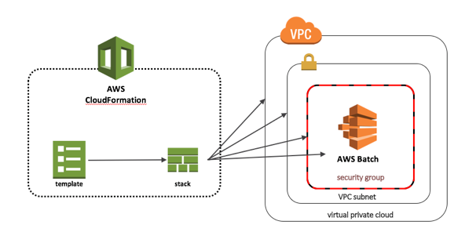

# Creating Hello World AWS Batch Stack
- [First download the sample templates zip file](https://docs.aws.amazon.com/AWSCloudFormation/latest/UserGuide/cfn-sample-templates.html)
- Extract the above zip file and use template **Managed_EC2_Batch_Environment.template**
- coverted the json to yaml format using json to yaml converter - **Managed_EC2_Batch_Environment.yaml**, [see](https://www.json2yaml.com/)  
- AWS::Region, AWS::Account referred in yaml are called [Pseudo parameters](https://docs.aws.amazon.com/AWSCloudFormation/latest/UserGuide/pseudo-parameter-reference.html)

# Launching a “Hello World” example stack
"Hello World” example of a CloudFormation stack with AWS Batch resources.

This example registers a simple job definition, a job queue that can accept job submissions, and a compute environment that contains the compute resources used to execute your job. The stack template also creates additional AWS resources that are required by AWS Batch:

- An IAM service role that gives AWS Batch permissions to take the required actions on your behalf
- An IAM ECS instance role
- A VPC
- A VPC subnet
- A security group

Following CLI command completes stack creation, [see here for details](https://docs.aws.amazon.com/cli/latest/reference/cloudformation/create-stack.html) :
> aws cloudformation validate-template --template-body file://Managed_EC2_Batch_Environment.yaml
> 
> aws --region us-east-1 cloudformation create-stack --stack-name hello-world-batch-stack --template-body file://Managed_EC2_Batch_Environment.yaml  --capabilities CAPABILITY_IAM

> Output from above command:
>> {
    "StackId": "arn:aws:cloudformation:us-east-1:Your-AWS_ACCT:stack/hello-world-batch-stack/q23455-6cb4-11ec-acfe-123456"
} 

Reference:
- [json to yaml converter](https://www.json2yaml.com/)
- [yaml lint to veify generated yaml]((http://www.yamllint.com/))
- [Also see](https://aws.amazon.com/blogs/compute/creating-a-simple-fetch-and-run-aws-batch-job/)
- [Sourced](https://aws.amazon.com/blogs/compute/using-aws-cloudformation-to-create-and-manage-aws-batch-resources/)