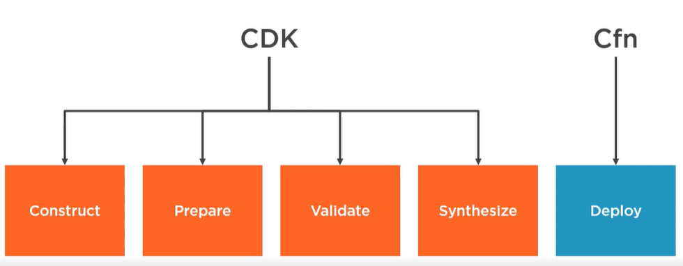

## AWS CDK reference
- https://docs.aws.amazon.com/cdk/latest/guide/home.html
- https://docs.aws.amazon.com/cdk/api/latest/python/modules.html
- https://docs.aws.amazon.com/cdk/api/latest/docs/@aws-cdk_aws-s3.Bucket.html

# CDK Setup
- python
- install node js, node and npm gets installed; node --version
- aws cli; aws --version
- aws cdk cli; npm install -g aws-cdk; cdk --version

# create cdk code
- Created folder cdk under cloudformation
- cd cdk
- mkdir demo_app; cd demo_app
- cdk init --language python
- above command create virtual env, app.py, cdk.json,etc,..., see picture below, everything inside the red box
- 
- source .env\Scripts\activate.bat
- pip install -r requirements.txt
- cdk ls --> return "DemoAppStack"
- cdk diff --> shows if we did  a cdk deploy what resources will get deployed
- cdk synth > demo-stack.yaml

# Context Methods
Context method in the CDK is a key‑value pair associated with your stack or your construct, this might be an
Availability Zone or an AMI etc.

#CDK Deploy 
When you run a cdk deploy, and this will be useful for us to know as we go further on into 
this module. The first thing it's doing is it's running the construction phase, and this is
what's going to instantiate all of your code, all of your apps and stacks are going to get 
run at this time. Most, if not all, of your app code is going to be executed during this 
stage. The second stage is the preparation stage. This stage happens automatically, and 
you won't see any feedback from it. It's very rare you'll notice it at all. And the next 
one is significantly more important; it's the validation phase, and this will validate that 
all of your code will deploy correctly as you've defined it. So if you have a misconfigured 
stack or some sort of runtime exception, something that's going to break your deployment, 
that should get picked up here. And then in the final stage, it's going to synthesize your
code into a CloudFormation template. So, like we said a few times already, the CDK is 
really just a wrapper for CloudFormation. All it's doing is it's using Python in this case, 
to generate CloudFormation, and then CloudFormation itself will handle the deployment of it.

