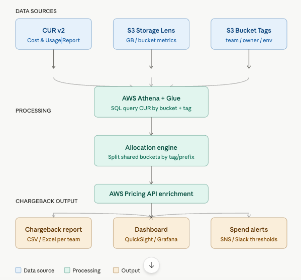

Here's the definitive architecture for computing accurate S3 chargeback costs at scale:---
  

## The 4 methods, ranked by accuracy

### 1. ✅ CUR v2 + Athena — most accurate (recommended)

This is the gold standard. CUR gives you the **exact billed amount** per resource, not an estimate.

**Core Athena query:**

```sql
SELECT
  resource_tags_user_team                   AS team,
  resource_tags_user_owner                  AS owner,
  line_item_resource_id                     AS bucket_name,
  line_item_usage_type,
  SUM(line_item_unblended_cost)             AS storage_cost_usd,
  SUM(line_item_usage_amount)               AS usage_amount
FROM   cur_database.cur_table
WHERE  year  = '2026'
  AND  month IN ('1','2','3')
  AND  line_item_product_code    = 'AmazonS3'
  AND  line_item_line_item_type IN ('Usage','Tax')
GROUP BY 1,2,3,4
ORDER BY storage_cost_usd DESC;
```

This naturally captures storage tiers (Standard, IA, Glacier), request costs, and data transfer — everything on the
bill.

**Accuracy: ~100%** — reconciles exactly to your AWS invoice.

---

### 2. ✅ S3 Storage Lens + Pricing API — accurate estimate

If CUR isn't available, Storage Lens gives per-bucket GB usage, and you price it yourself.

```python
import boto3

s3control = boto3.client('s3control', region_name='us-east-1')
pricing = boto3.client('pricing', region_name='us-east-1')

# Storage tiers and their $/GB-month (us-east-1, 2026 approx)
PRICES = {
    'StandardStorage': 0.023,
    'StandardIAStorage': 0.0125,
    'GlacierInstantStorage': 0.004,
    'IntelligentTieringStorage': 0.023,
}


def get_chargeback(storage_lens_export, tag_map):
    rows = []
    for bucket, metrics in storage_lens_export.items():
        tags = tag_map.get(bucket, {})
        cost = sum(
            metrics.get(tier, 0) / 1e9 * price  # bytes → GB
            for tier, price in PRICES.items()
        )
        rows.append({
            'bucket': bucket,
            'team': tags.get('team', 'untagged'),
            'cost_usd': round(cost * 3, 4),  # × 3 months
        })
    return rows
```

**Accuracy: ~90–95%** — misses request charges and data transfer, which are usually small.

---

### 3. ⚠️ Cost Explorer export — quick but limited

Good for a fast read. Group by `Service=S3` + your cost allocation tag, export CSV, pivot in Excel. The catch: it shows
tag-level totals, not per-bucket when a bucket has multiple tags or is untagged.

**Accuracy: ~80–85%** — depends entirely on tagging discipline.

---

### 4. 🔧 Shared bucket split — for multi-team buckets

When multiple teams share one bucket, split cost by storage proportion:

```python
def split_shared_bucket_cost(total_cost, prefix_sizes):
    """
    prefix_sizes = {'team-a/': 400_GB, 'team-b/': 100_GB}
    Returns cost per team proportional to their prefix size.
    """
    total_gb = sum(prefix_sizes.values())
    return {
        team: round(total_cost * (gb / total_gb), 4)
        for team, gb in prefix_sizes.items()
    }
```

Use S3 Inventory + Storage Lens prefix metrics to get prefix-level sizes.

---

## Chargeback model comparison

| Model                     | Best when                     | Tooling                       | Accuracy |
|---------------------------|-------------------------------|-------------------------------|----------|
| Direct tag-based          | Each team owns its buckets    | CUR + Athena                  | ~100%    |
| Proportional prefix split | Shared platform buckets       | S3 Inventory + custom script  | ~95%     |
| Showback only             | Building awareness first      | Cost Explorer                 | ~80%     |
| Amortized / reserved      | Large org with S3 commitments | CUR `SavingsPlanCoveredUsage` | ~100%    |

---

## Prerequisites checklist

Before any method works well, you need these in place:

```
[ ] CUR v2 enabled in AWS Billing Console (admin req.)
[ ] Cost allocation tags activated (admin req.)
[ ] All S3 buckets tagged: team, owner, cost-center, env
[ ] S3 Storage Lens enabled at org or account level
[ ] Athena + Glue crawler pointed at CUR S3 bucket
[ ] Tagging policy enforced via AWS Config or SCP
```

---

## Recommended automation schedule

```
Monthly (1st of month):
  → Athena query runs for prior month
  → Python script splits shared buckets by prefix
  → CSV generated per team/cost-center
  → Emailed via SES or posted to Slack

Weekly:
  → Storage Lens dashboard refreshed
  → Anomaly alerts fired if bucket cost > threshold
```

Would you like me to generate the full Python pipeline script, the Athena table setup for CUR v2, or the tagging policy
template?