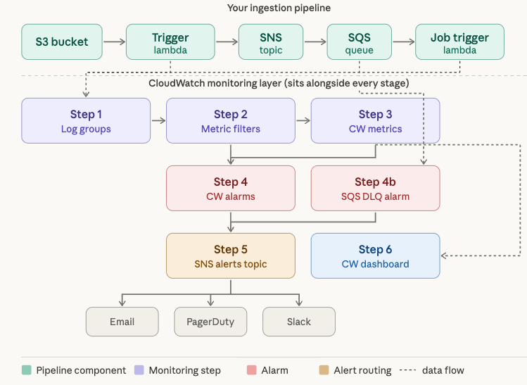

Here's a full walkthrough of every step, with inline comments explaining exactly how each piece connects to the next to
form a complete alerting chain.

First, let's visualize how all the pieces fit together:Now here's every step explained in full, with inline comments
showing exactly how each piece connects to the next:

---

## Step 1 — Create log groups for both Lambdas

Every Lambda automatically writes stdout/stderr to CloudWatch Logs. This step either lets that happen naturally or
pre-creates the group so you can set retention before the first invocation.

**Why this is the foundation**: Every subsequent step (metric filters, alarms, dashboards) points at a specific log
group name. Without a log group, there's nothing to monitor.

```bash
# Creates the named log group in CloudWatch Logs.
# If Lambda already ran once, this group exists — but creating it explicitly
# lets you set retention BEFORE logs accumulate (you can't retroactively purge old logs).
aws logs create-log-group --log-group-name /aws/lambda/ingest-trigger-lambda
aws logs create-log-group --log-group-name /aws/lambda/job-trigger-lambda

# Retention policy: logs older than 30 days are deleted automatically.
# Without this, logs accumulate forever and you pay for storage indefinitely.
# This feeds Step 2 (metric filters) — filters only scan logs that exist here.
aws logs put-retention-policy \
  --log-group-name /aws/lambda/ingest-trigger-lambda \
  --retention-in-days 30

aws logs put-retention-policy \
  --log-group-name /aws/lambda/job-trigger-lambda \
  --retention-in-days 30
```

---

## Step 2 — Emit structured logs from both Lambdas

Before you can filter for errors, your Lambdas have to actually write meaningful, queryable log lines. The key insight
here is that CloudWatch Metric Filters match on plain text patterns — so your log format determines what you can alarm
on.

```python
import json, logging

logger = logging.getLogger()
logger.setLevel(logging.INFO)


def handler(event, context):
    # Extract the S3 key from the event so every log line is traceable
    # to a specific file — this makes debugging far easier downstream
    file_key = event.get("Records", [{}])[0].get("s3", {}).get("object", {}).get("key", "unknown")

    try:
        # ... your ingestion logic here ...

        # SUCCESS path: CloudWatch Logs receives this line.
        # The "status" field lets you build metric filters for success rate too
        logger.info(json.dumps({
            "status": "success",
            "file": file_key,
            "pipeline_stage": "ingest-trigger"  # useful for cross-stage correlation
        }))

    except Exception as e:
        # FAILURE path: the word "ERROR" in this line is what Step 3's
        # metric filter will match on. Every ERROR log → increments a counter metric.
        logger.error(json.dumps({
            "status": "error",
            "error": str(e),
            "file": file_key,
            "pipeline_stage": "ingest-trigger"
        }))

        # re-raise so Lambda marks the invocation as FAILED —
        # this feeds the built-in AWS/Lambda Errors metric (used in Step 4a alarm)
        raise
```

---

## Step 3 — Create metric filters on the log groups

This is the "translation layer" — it watches the raw log stream and every time a log line matches a pattern, it
increments a custom CloudWatch metric. That metric is what your alarms will actually trigger on.

```bash
# Metric filter for the TRIGGER lambda.
# --filter-pattern "ERROR" scans every incoming log line for the literal string "ERROR"
# When matched → metricValue=1 is added to the IngestTriggerErrors metric
# defaultValue=0 means: even when no errors occur, a zero data point is published
#   (without this, CloudWatch sees "no data" instead of "zero errors", which breaks alarms)
aws logs put-metric-filter \
  --log-group-name /aws/lambda/ingest-trigger-lambda \  # <-- points at the log group from Step 1
  --filter-name "ErrorFilter" \
  --filter-pattern "ERROR" \                            # matches any line containing "ERROR"
  --metric-transformations \
    metricName=IngestTriggerErrors,\
    metricNamespace=YourPipeline,\    # groups your custom metrics under one namespace
    metricValue=1,\
    defaultValue=0

# Same for JOB TRIGGER lambda — creates a separate metric so you can
# distinguish which lambda in the pipeline failed
aws logs put-metric-filter \
  --log-group-name /aws/lambda/job-trigger-lambda \     # <-- second log group from Step 1
  --filter-name "ErrorFilter" \
  --filter-pattern "ERROR" \
  --metric-transformations \
    metricName=JobTriggerErrors,\
    metricNamespace=YourPipeline,\
    metricValue=1,\
    defaultValue=0

# OPTIONAL: Track success rate too. If you alarm on ErrorRate (errors/total)
# rather than raw error count, you avoid false alarms during low-traffic periods
aws logs put-metric-filter \
  --log-group-name /aws/lambda/job-trigger-lambda \
  --filter-name "SuccessFilter" \
  --filter-pattern "\"status\": \"success\"" \
  --metric-transformations \
    metricName=JobTriggerSuccess,\
    metricNamespace=YourPipeline,\
    metricValue=1,\
    defaultValue=0
```

---

## Step 4 — Create CloudWatch alarms

This is the "decision layer" — it continuously evaluates the metrics from Step 3 (and AWS built-in metrics) and
transitions to ALARM state when a threshold is breached. The alarm action is what calls your SNS topic from Step 5.

```bash
# ALARM A: Built-in Lambda error metric (separate from your log-based metric)
# AWS/Lambda Errors counts invocations that threw an unhandled exception.
# Your re-raise in Step 2 feeds this. This catches errors even if
# your logger.error() call itself fails for some reason.
aws cloudwatch put-metric-alarm \
  --alarm-name "IngestLambda-Errors" \
  --metric-name Errors \
  --namespace AWS/Lambda \                              # built-in namespace, not custom
  --dimensions Name=FunctionName,Value=ingest-trigger-lambda \
  --statistic Sum \
  --period 60 \                                         # evaluate every 60 seconds
  --threshold 1 \                                       # alarm if >= 1 error in the window
  --comparison-operator GreaterThanOrEqualToThreshold \
  --evaluation-periods 1 \                              # alarm immediately on first breach
  --alarm-actions arn:aws:sns:...:pipeline-alerts \     # <-- triggers Step 5's SNS topic
  --ok-actions    arn:aws:sns:...:pipeline-alerts        # <-- also notifies when it recovers


# ALARM B: Your custom log-based error metric from Step 3
# Two alarms for the same lambda serves a purpose:
#   Alarm A fires on unhandled crashes
#   Alarm B fires on caught errors you explicitly logged
# Together they cover both failure modes
aws cloudwatch put-metric-alarm \
  --alarm-name "IngestLambda-LogErrors" \
  --metric-name IngestTriggerErrors \
  --namespace YourPipeline \                            # <-- custom namespace from Step 3
  --statistic Sum \
  --period 60 \
  --threshold 1 \
  --comparison-operator GreaterThanOrEqualToThreshold \
  --evaluation-periods 1 \
  --alarm-actions arn:aws:sns:...:pipeline-alerts

# ALARM C: SQS Dead Letter Queue depth — this is your most important alarm.
# When a message fails processing N times (configurable on the queue),
# SQS moves it to the DLQ. A DLQ message means the job-trigger lambda
# repeatedly failed on a specific file — manual intervention is needed.
aws cloudwatch put-metric-alarm \
  --alarm-name "SQS-DLQ-HasMessages" \
  --metric-name ApproximateNumberOfMessagesVisible \
  --namespace AWS/SQS \
  --dimensions Name=QueueName,Value=your-ingestion-dlq \
  --statistic Maximum \
  --period 60 \
  --threshold 1 \                                       # even 1 DLQ message = alarm
  --comparison-operator GreaterThanOrEqualToThreshold \
  --evaluation-periods 1 \
  --alarm-actions arn:aws:sns:...:pipeline-alerts

# ALARM D: SQS queue age — catches stuck queues even if there are no DLQ messages yet.
# If a message has been sitting unprocessed for > 5 minutes, the job-trigger
# lambda has probably stopped polling (crashed or throttled).
aws cloudwatch put-metric-alarm \
  --alarm-name "SQS-MessageAge-High" \
  --metric-name ApproximateAgeOfOldestMessage \
  --namespace AWS/SQS \
  --dimensions Name=QueueName,Value=your-ingestion-queue \
  --statistic Maximum \
  --period 60 \
  --threshold 300 \                                     # 300 seconds = 5 minutes
  --comparison-operator GreaterThanOrEqualToThreshold \
  --evaluation-periods 1 \
  --alarm-actions arn:aws:sns:...:pipeline-alerts

# ALARM E: SNS notification failures — if SNS can't deliver to SQS,
# the pipeline silently drops files. This alarm catches that gap.
aws cloudwatch put-metric-alarm \
  --alarm-name "SNS-DeliveryFailures" \
  --metric-name NumberOfNotificationsFailed \
  --namespace AWS/SNS \
  --dimensions Name=TopicName,Value=your-ingest-topic \
  --statistic Sum \
  --period 60 \
  --threshold 1 \
  --comparison-operator GreaterThanOrEqualToThreshold \
  --evaluation-periods 1 \
  --alarm-actions arn:aws:sns:...:pipeline-alerts
```

---

## Step 5 — Create an SNS alerts topic and wire up subscribers

The SNS topic here is a *different* one from your pipeline's SNS. This is a dedicated **alerts** topic. All five alarms
from Step 4 send to it, and it fans out to your notification channels.

```bash
# Create a dedicated alerts topic. Keep this SEPARATE from your pipeline SNS —
# mixing operational alerts with pipeline messages creates a circular failure:
# if the pipeline SNS has issues, your alert for that issue also fails to deliver.
aws sns create-topic --name pipeline-alerts
# Returns: TopicArn: arn:aws:sns:us-east-1:123456789:pipeline-alerts
# This ARN is what you paste into every --alarm-actions in Step 4

# Subscribe an email address. AWS sends a confirmation email — you must click it
# or the subscription stays "PendingConfirmation" and receives nothing.
aws sns subscribe \
  --topic-arn arn:aws:sns:us-east-1:123456789:pipeline-alerts \
  --protocol email \
  --notification-endpoint oncall@yourcompany.com

# Subscribe PagerDuty (or Opsgenie) via HTTPS webhook.
# This is how you get paged for critical DLQ alarms, not just emailed.
aws sns subscribe \
  --topic-arn arn:aws:sns:us-east-1:123456789:pipeline-alerts \
  --protocol https \
  --notification-endpoint https://events.pagerduty.com/integration/YOUR_KEY/enqueue

# Slack: subscribe a Lambda that reformats the SNS JSON and posts to a channel
# SNS → Slack Lambda → Slack webhook. Gives you richer formatting than raw SNS email.
aws sns subscribe \
  --topic-arn arn:aws:sns:us-east-1:123456789:pipeline-alerts \
  --protocol lambda \
  --notification-endpoint arn:aws:lambda:...:slack-notifier
```

---

## Step 6 — Build a CloudWatch Dashboard

The dashboard is your **operational nerve center** — it pulls together all the metrics from Steps 3 and 4 into one view.
You don't need it for alerting, but without it you're flying blind when you get paged and need to diagnose fast.

```bash
aws cloudwatch put-dashboard \
  --dashboard-name IngestionPipeline \
  --dashboard-body '{
    "widgets": [

      {
        "type": "alarm",
        "properties": {
          "title": "Active alarms",
          "alarms": [
            "arn:aws:...:alarm:IngestLambda-Errors",
            "arn:aws:...:alarm:SQS-DLQ-HasMessages",
            "arn:aws:...:alarm:SQS-MessageAge-High",
            "arn:aws:...:alarm:SNS-DeliveryFailures"
          ]
        }
        # Top of the dashboard: single pane shows all alarm states
        # Red = actively firing, green = OK. You see immediately which alarm woke you up.
      },

      {
        "type": "metric",
        "properties": {
          "title": "Lambda errors (both stages)",
          "metrics": [
            ["AWS/Lambda", "Errors", "FunctionName", "ingest-trigger-lambda"],
            ["AWS/Lambda", "Errors", "FunctionName", "job-trigger-lambda"],
            # Custom log-based metrics from Step 3 sit alongside built-in metrics
            ["YourPipeline", "IngestTriggerErrors"],
            ["YourPipeline", "JobTriggerErrors"]
          ],
          "stat": "Sum", "period": 60, "view": "timeSeries"
          # Time-series view lets you see exactly when errors spiked vs normal traffic
        }
      },

      {
        "type": "metric",
        "properties": {
          "title": "SQS queue health",
          "metrics": [
            ["AWS/SQS", "ApproximateNumberOfMessagesVisible",   "QueueName", "your-ingestion-queue"],
            ["AWS/SQS", "ApproximateAgeOfOldestMessage",        "QueueName", "your-ingestion-queue"],
            ["AWS/SQS", "ApproximateNumberOfMessagesVisible",   "QueueName", "your-ingestion-dlq"]
            # Seeing main queue depth + DLQ depth together immediately tells you
            # if messages are being consumed or piling up
          ],
          "stat": "Maximum", "period": 60
        }
      },

      {
        "type": "metric",
        "properties": {
          "title": "Lambda invocation volume",
          "metrics": [
            ["AWS/Lambda", "Invocations", "FunctionName", "ingest-trigger-lambda"],
            ["AWS/Lambda", "Invocations", "FunctionName", "job-trigger-lambda"]
          ],
          "stat": "Sum", "period": 300
          # Invocation volume is your baseline. If errors spike but invocations
          # also spike, it might be a noisy upstream. If errors spike but invocations
          # are flat, something is systematically broken.
        }
      }

    ]
  }'
```

---

## How the full chain fires end-to-end

When a file lands in S3 and something goes wrong, here is the exact sequence:

```
1. File lands in S3
2. S3 event triggers ingest-trigger-lambda
3. Lambda fails → logs  {"status":"error", ...}  to /aws/lambda/ingest-trigger-lambda
4. Lambda re-raises → AWS/Lambda Errors metric increments by 1
5. Metric filter (Step 3) sees "ERROR" in the log → increments IngestTriggerErrors by 1
6. CW alarm (Step 4, Alarm A) evaluates AWS/Lambda Errors ≥ 1 → transitions to ALARM
7. CW alarm (Step 4, Alarm B) evaluates IngestTriggerErrors ≥ 1 → transitions to ALARM
8. Both alarms publish a message to arn:aws:sns:...:pipeline-alerts (Step 5)
9. SNS fans out to:
     → Email lands in oncall@yourcompany.com
     → PagerDuty webhook creates an incident and pages the on-call engineer
     → Slack Lambda posts a formatted message to #ingestion-alerts
10. Engineer opens the CloudWatch Dashboard (Step 6) and sees the error spike
    alongside queue depth and invocation volume to understand scope
11. Engineer checks the log group directly in CloudWatch Logs Insights:
      fields @timestamp, status, error, file
      | filter status = "error"
      | sort @timestamp desc
      | limit 20
    → Sees exactly which file keys failed and why
```

This is why `defaultValue=0` in your metric filters and `ok-actions` on your alarms both matter — without them you get
noisy "no data" states and you miss recovery notifications.