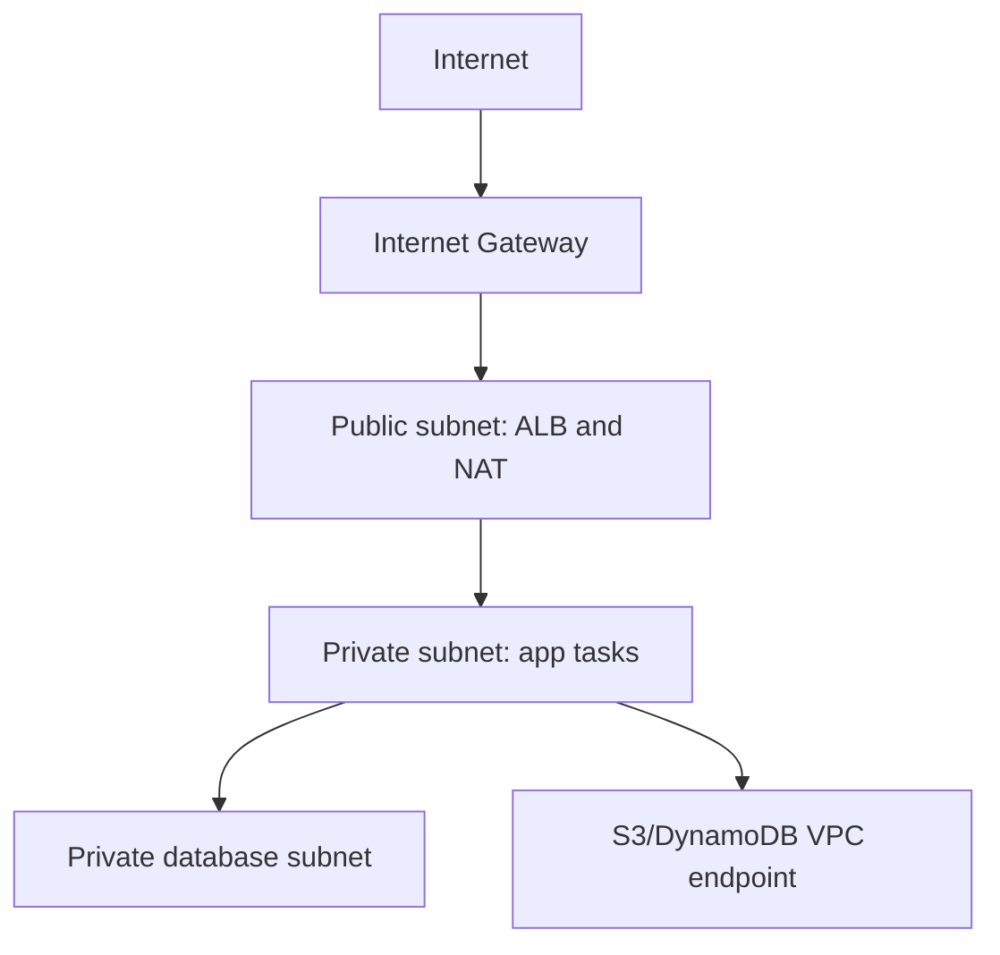
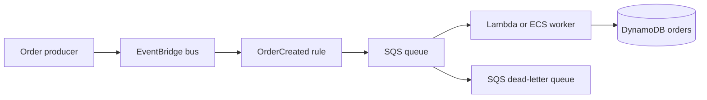
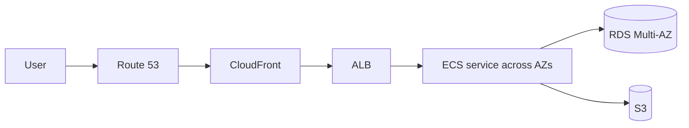

# AWS Python Boto3 Interview Handbook

A standalone handbook for AWS services, cloud architecture, Python automation with Boto3, LocalStack development, production engineering practices, troubleshooting, and interview preparation.

## Table of contents
1. [How to use this handbook](#1-how-to-use-this-handbook)
2. [Cloud computing and AWS fundamentals](#2-cloud-computing-and-aws-fundamentals)
3. [AWS global infrastructure](#3-aws-global-infrastructure)
4. [AWS accounts, organizations, and identity](#4-aws-accounts-organizations-and-identity)
5. [macOS development environment](#5-macos-development-environment)
6. [Running AWS locally without an AWS account](#6-running-aws-locally-without-an-aws-account)
7. [Recommended AWS automation project structure](#7-recommended-aws-automation-project-structure)
8. [Boto3 fundamentals](#8-boto3-fundamentals)
9. [Reusable client configuration](#9-reusable-client-configuration)
10. [Credentials and authentication](#10-credentials-and-authentication)
11. [Boto3 responses and error handling](#11-boto3-responses-and-error-handling)
12. [Pagination, retries, waiters, and idempotency](#12-pagination-retries-waiters-and-idempotency)
13. [Amazon S3](#13-amazon-s3)
14. [Amazon SQS](#14-amazon-sqs)
15. [Amazon SNS and EventBridge](#15-amazon-sns-and-eventbridge)
16. [Amazon DynamoDB](#16-amazon-dynamodb)
17. [AWS Lambda](#17-aws-lambda)
18. [Amazon EC2 and compute choices](#18-amazon-ec2-and-compute-choices)
19. [Databases, analytics, and data platforms](#19-databases-analytics-and-data-platforms)
20. [AWS networking](#20-aws-networking)
21. [Monitoring, logging, and auditing](#21-monitoring-logging-and-auditing)
22. [Security and secrets management](#22-security-and-secrets-management)
23. [Infrastructure as code](#23-infrastructure-as-code)
24. [Most commonly used AWS architecture patterns](#24-most-commonly-used-aws-architecture-patterns)
25. [Testing Boto3 applications](#25-testing-boto3-applications)
26. [Production-ready Boto3 patterns](#26-productionready-boto3-patterns)
27. [Performance, reliability, and cost optimization](#27-performance-reliability-and-cost-optimization)
28. [Troubleshooting guide](#28-troubleshooting-guide)
29. [Frequently used Boto3 snippets](#29-frequently-used-boto3-snippets)
30. [Runnable LocalStack projects](#30-runnable-localstack-projects)
31. [AWS interview questions and answers](#31-aws-interview-questions-and-answers)
32. [Boto3 interview questions](#32-boto3-interview-questions)
33. [Scenario-based interview questions](#33-scenariobased-interview-questions)
34. [Architecture interview exercises](#34-architecture-interview-exercises)
35. [Quick-revision sheets](#35-quickrevision-sheets)

## 1. How to use this handbook

**Beginner** **Intermediate** **Advanced** **Interview answer**

This handbook is a standalone desk reference for AWS architecture and Python automation with Boto3. It assumes you already know Python syntax and focuses on how to use Python safely with AWS APIs.

Use it in three ways:

- As a tutorial: read sections 1 through 12 first, then study one service section at a time.
- As a daily reference: jump to service sections, snippets, troubleshooting, and production patterns.
- As interview preparation: practice the concise answers, then expand into trade-offs and failure modes.

Examples are labeled:

- **Runs with LocalStack:** safe local examples using Docker and dummy credentials.
- **Requires real AWS:** examples that need AWS features, IAM, networking, or managed services not fully simulated locally.
- **Production note:** guidance for real systems.
- **Security note:** identity, secrets, encryption, and blast-radius guidance.
- **Performance note:** throughput, latency, API count, and memory guidance.
- **Reliability note:** retries, idempotency, and failure handling.
- **Cost note:** billing and waste-prevention guidance.
- **Common mistake:** frequent pitfalls and corrected patterns.

Code style note: examples intentionally prefer clear step-by-step code over compact tricks. You will often see explicit loops, `if` checks, and named intermediate variables instead of nested comprehensions or dense one-liners.

**Beginner learning path**

1. Cloud fundamentals, global infrastructure, accounts, and IAM.
2. macOS setup, AWS CLI, LocalStack, and Boto3 client creation.
3. S3, SQS, SNS/EventBridge, DynamoDB, and Lambda.
4. Error handling, pagination, retries, waiters, and testing.
5. Complete the S3 file manager project.

**Intermediate learning path**

1. Build reusable client factories and project structure.
2. Study event-driven patterns, idempotency, partial failures, and DLQs.
3. Study EC2 safety controls, monitoring, secrets, IaC, and networking.
4. Complete the reliable SQS worker and order pipeline projects.

**Advanced learning path**

1. Multi-account, multi-Region, platform engineering, security architecture, cost governance.
2. Cross-account automation, centralized logging, disaster recovery, data platforms.
3. Practice architecture and scenario interview exercises.

**Official references used for validation**

- AWS Boto3 documentation: https://boto3.amazonaws.com/v1/documentation/api/latest/index.html
- Botocore configuration documentation: https://botocore.amazonaws.com/v1/documentation/api/latest/reference/config.html
- AWS SDK credential provider guide: https://boto3.amazonaws.com/v1/documentation/api/latest/guide/credentials.html
- LocalStack documentation: https://docs.localstack.cloud/
- Docker Compose documentation: https://docs.docker.com/compose/


## 2. Cloud computing and AWS fundamentals

**Beginner** **Interview answer**

Cloud computing is on-demand access to compute, storage, networking, databases, analytics, and security services through APIs. AWS lets teams provision infrastructure quickly, pay for usage, and design applications across isolated failure domains.

| Concept | Plain-English explanation |
| --- | --- |
| IaaS | Infrastructure as a Service: you manage the OS and app; AWS manages physical facilities and virtualization. EC2 is the classic example. |
| PaaS | Platform as a Service: AWS manages more runtime details. Lambda, Elastic Beanstalk, and managed databases reduce platform work. |
| SaaS | Software as a Service: complete software consumed as a service. |
| Public cloud | Provider-operated infrastructure shared across tenants with logical isolation. |
| Private cloud | Cloud operating model dedicated to one organization. |
| Hybrid cloud | Integrated on-premises and cloud systems. |
| Scalability | Ability to handle more load by adding capacity. |
| Elasticity | Automatic scaling up and down with demand. |
| High availability | Designing to remain available through component failure. |
| Fault tolerance | Continuing operation with little or no interruption after failure. |
| Reliability | Consistent correct operation over time. |
| Durability | Likelihood that stored data will not be lost. |
| Disaster recovery | Plans and systems to restore service after a major event. |
| Shared responsibility | AWS secures the cloud; customers secure what they run in the cloud. |
| CapEx vs OpEx | Cloud shifts many large capital purchases to operating expenses. |

**Key comparisons**

- Scalability vs elasticity: scalability is capacity growth; elasticity is automatic capacity adjustment.
- High availability vs fault tolerance: HA reduces downtime; fault tolerance hides failures from users.
- Availability vs durability: availability is access; durability is data survival.
- Backup vs disaster recovery: backup is a copy; DR is a tested restoration strategy.
- Vertical vs horizontal scaling: vertical uses larger machines; horizontal uses more machines.

**Interview answer:** "I design cloud systems around failure domains, identity boundaries, automation, observability, and cost. AWS gives me Regions, Availability Zones, managed services, and APIs so I can build systems that scale and recover predictably."


## 3. AWS global infrastructure

**Beginner** **Intermediate**

AWS global infrastructure is organized into Regions, Availability Zones, edge locations, Local Zones, and Wavelength Zones.

- Region: a geographic area such as `us-east-1`.
- Availability Zone: one or more isolated data centers inside a Region.
- Edge location: location near users for CloudFront, Route 53, and edge services.
- Local Zone: infrastructure near large metro areas for low latency.
- Wavelength Zone: AWS infrastructure inside 5G provider networks.
- Regional service: service resources exist in a Region, such as EC2, Lambda, RDS, DynamoDB tables, and S3 buckets.
- Global service: service has a global control plane or namespace, such as IAM, Route 53, CloudFront, and AWS Organizations.

**Region selection checklist**

| Factor | Questions to ask |
| --- | --- |
| Customer location | Where are users and data producers? |
| Latency | What round-trip time is acceptable? |
| Compliance | Must data stay in a country or jurisdiction? |
| Cost | Are compute, transfer, and managed-service costs materially different? |
| Service availability | Is every required feature available in that Region? |
| DR | Which second Region meets RTO/RPO and compliance requirements? |

**Multi-AZ architecture:** deploy across multiple AZs in one Region for normal high availability.

**Multi-Region architecture:** replicate or redeploy across Regions for disaster recovery, global latency, or data residency. It adds DNS failover, data replication, KMS/secrets planning, consistency trade-offs, and cost.


## 4. AWS accounts, organizations, and identity

**Beginner** **Intermediate** **Security note**

An AWS account is a strong isolation boundary for billing, quotas, identity, blast radius, and audit. Production organizations usually use AWS Organizations with multiple accounts.

| Term | Meaning |
| --- | --- |
| Root user | The original all-powerful account identity. Lock it down with MFA and do not use it for daily work. |
| IAM user | Long-lived identity, usually for humans or legacy automation. Prefer roles. |
| IAM role | Assumable identity with temporary credentials. Best for workloads and cross-account access. |
| IAM policy | JSON permissions document describing allowed or denied actions. |
| Trust policy | Defines who can assume a role. |
| Resource policy | Policy attached to a resource, such as an S3 bucket or KMS key. |
| Permission boundary | Maximum permissions a principal can receive. |
| SCP | AWS Organizations guardrail that limits account permissions. |
| STS | Service that issues temporary credentials. |
| IAM Identity Center | Central workforce access and SSO for AWS accounts and applications. |

**Comparisons**

- IAM user vs role: users have long-term credentials; roles provide temporary credentials.
- Identity policy vs resource policy: identity policies attach to identities; resource policies attach to resources.
- Trust policy vs permissions policy: trust policy controls role assumption; permissions policy controls actions after assumption.
- Permission boundary vs SCP: boundary limits an IAM principal; SCP limits an account or OU. Neither grants access by itself.
- Explicit allow vs explicit deny: explicit deny always wins.
- Long-term vs temporary credentials: temporary credentials expire and reduce exposure.

**Safe identity policy**

```json
{
  "Version": "2012-10-17",
  "Statement": [
    {
      "Effect": "Allow",
      "Action": ["s3:GetObject", "s3:PutObject"],
      "Resource": "arn:aws:s3:::<BUCKET_NAME>/incoming/*",
      "Condition": {
        "StringEquals": {
          "aws:RequestedRegion": "<AWS_REGION>"
        }
      }
    }
  ]
}
```

**Safe trust policy**

```json
{
  "Version": "2012-10-17",
  "Statement": [
    {
      "Effect": "Allow",
      "Principal": {
        "AWS": "arn:aws:iam::<AWS_ACCOUNT_ID>:role/<CALLER_ROLE_NAME>"
      },
      "Action": "sts:AssumeRole"
    }
  ]
}
```

**Interview answer:** "Least privilege means granting only the actions, resources, conditions, and duration required. I prefer roles and temporary credentials, verify with CloudTrail and Access Analyzer, and use SCPs or permission boundaries for guardrails."


## 5. macOS development environment

**Beginner** **Runs with LocalStack**

These commands target macOS. Apple Silicon and Intel Macs mostly use the same commands; Apple Silicon Homebrew usually lives under `/opt/homebrew`, while Intel Homebrew usually lives under `/usr/local`.

**Install Homebrew**

```bash
/bin/bash -c "$(curl -fsSL https://raw.githubusercontent.com/Homebrew/install/HEAD/install.sh)"
brew --version
```

If `brew` is not found, add the path printed by the installer to your shell profile:

```bash
echo 'eval "$(/opt/homebrew/bin/brew shellenv)"' >> ~/.zprofile
source ~/.zprofile
```

**Install tools**

```bash
brew install python
brew install git
brew install awscli
brew install localstack/tap/localstack-cli
python3 --version
git --version
aws --version
localstack --version
```

Install Docker Desktop from https://www.docker.com/products/docker-desktop/ and start it before running LocalStack. On Apple Silicon, keep Docker Desktop updated; older images and Lambda runtimes may need multi-architecture support.

**Create a virtual environment**

```bash
python3 -m venv .venv
source .venv/bin/activate
python -m pip install --upgrade pip
python -m pip install boto3 botocore pytest moto localstack awscli-local python-dotenv
python -m pip freeze > requirements.txt
```

**Verify versions**

```bash
python -c "import boto3, botocore; print(boto3.__version__, botocore.__version__)"
awslocal --version
docker version
docker compose version
```

**Minimal `pyproject.toml`**

```toml
[project]
name = "aws-automation"
version = "0.1.0"
requires-python = ">=3.11"
dependencies = [
  "boto3",
  "botocore",
  "python-dotenv",
]

[project.optional-dependencies]
dev = ["pytest", "moto", "localstack", "awscli-local"]
```

**Common fixes**

- PATH issue: run `which python3`, `which aws`, and `which awslocal`; add Homebrew to `.zprofile`.
- Docker not running: open Docker Desktop and wait until the engine is ready.
- Apple Silicon image issue: update Docker Desktop; use current images; avoid old Lambda runtimes.
- Permission denied on Docker socket: Docker Desktop should manage this on macOS; restart Docker if stale.


## 6. Running AWS locally without an AWS account

**Beginner** **Runs with LocalStack**

LocalStack runs local emulations of many AWS APIs. It is excellent for fast feedback, CLI practice, and integration-style tests that should not touch a real AWS account.

**Use LocalStack for:** S3, SQS, SNS, DynamoDB, Lambda basics, EventBridge basics, Secrets Manager, SSM Parameter Store, CloudWatch Logs, IAM/STS simulations, and many CloudFormation workflows.

**Use real AWS for:** exact IAM behavior, VPC networking, service quotas, production Lambda runtime behavior, managed databases, advanced analytics, multi-account access, regional feature differences, and cost/latency validation.

**LocalStack vs Moto vs Stubber**

| Tool | Best use |
| --- | --- |
| Botocore Stubber | Unit tests that verify exact request and response shapes. |
| Moto | Fast in-process mock tests for many services. |
| LocalStack | Local integration tests through AWS-compatible HTTP endpoints. |
| Real AWS account | Final validation of IAM, networking, service limits, and production behavior. |

**Docker Compose**

```yaml
services:
  localstack:
    image: localstack/localstack:latest
    ports:
      - "127.0.0.1:4566:4566"
      - "127.0.0.1:4510-4559:4510-4559"
    environment:
      - SERVICES=s3,sqs,sns,dynamodb,lambda,events,stepfunctions,secretsmanager,ssm,cloudwatch,logs,iam,sts
      - DEBUG=0
      - AWS_DEFAULT_REGION=us-east-1
    volumes:
      - "/var/run/docker.sock:/var/run/docker.sock"
```

**Start and inspect**

```bash
docker compose up -d
docker compose ps
docker compose logs -f localstack
curl http://localhost:4566/_localstack/health
docker compose down
```

**Dummy local credentials**

```bash
export AWS_ACCESS_KEY_ID=test
export AWS_SECRET_ACCESS_KEY=test
export AWS_DEFAULT_REGION=us-east-1
export AWS_ENDPOINT_URL=http://localhost:4566
```

These values are local placeholders. They are not real AWS credentials and must not be used for real AWS access.

**Two equivalent CLI styles**

```bash
awslocal s3api list-buckets
aws --endpoint-url=http://localhost:4566 s3api list-buckets
```

**Common LocalStack errors**

- Connection refused: LocalStack is not running or port `4566` is blocked.
- Signature or credential errors: export dummy credentials and Region.
- Unsupported behavior: confirm whether the feature is supported in your LocalStack edition, then use real AWS for final validation.


## 7. Recommended AWS automation project structure

**Intermediate** **Production note**

A maintainable AWS automation project separates configuration, client creation, service logic, command entry points, and tests.

```text
aws-automation/
|-- README.md
|-- pyproject.toml
|-- requirements.txt
|-- docker-compose.yml
|-- .env.example
|-- src/
|   `-- aws_automation/
|       |-- __init__.py
|       |-- config.py
|       |-- clients.py
|       |-- logging_config.py
|       |-- services/
|       |   |-- s3_service.py
|       |   |-- sqs_service.py
|       |   `-- dynamodb_service.py
|       `-- main.py
`-- tests/
    |-- unit/
    `-- integration/
```

**Design rules**

- Configuration lives in environment variables, `.env`, CLI flags, Parameter Store, or Secrets Manager.
- Boto3 clients are created in one module and injected into service functions.
- Business logic should be testable without AWS.
- Integration tests can run against LocalStack.
- Real AWS tests should run only in a sandbox account with least-privilege roles.


## 8. Boto3 fundamentals

**Beginner** **Intermediate**

Boto3 is the AWS SDK for Python. Botocore handles service models, signing, retries, HTTP behavior, exceptions, and low-level clients. Boto3 adds sessions, clients, and some resource abstractions.

```python
import boto3

# Default session from environment/profile/role.
s3 = boto3.client("s3")

# Named profile and Region.
session = boto3.Session(profile_name="development", region_name="us-east-1")
dynamodb = session.client("dynamodb")

# LocalStack endpoint.
local_s3 = boto3.client(
    "s3",
    region_name="us-east-1",
    endpoint_url="http://localhost:4566",
)

# STS caller identity. Requires real AWS unless using LocalStack simulation.
identity = session.client("sts").get_caller_identity()
print(identity["Arn"])
```

**Client vs resource**

```python
s3_client = boto3.client("s3")
s3_resource = boto3.resource("s3")
```

Clients are usually preferred for production automation because they expose complete service APIs and map closely to AWS API documentation. Resources can be convenient but are not available for every service.

**Dependency injection**

```python
def list_bucket_names(s3_client) -> list[str]:
    response = s3_client.list_buckets()
    names = []
    for bucket in response.get("Buckets", []):
        names.append(bucket["Name"])
    return names
```


## 9. Reusable client configuration

**Intermediate** **Production note**

Use one reusable factory for real AWS and LocalStack.

```python
from __future__ import annotations

import boto3
from botocore.client import BaseClient
from botocore.config import Config


def create_client(
    service_name: str,
    *,
    region_name: str = "us-east-1",
    profile_name: str | None = None,
    endpoint_url: str | None = None,
) -> BaseClient:
    session = boto3.Session(
        profile_name=profile_name,
        region_name=region_name,
    )

    config = Config(
        retries={
            "mode": "standard",
            "max_attempts": 10,
        },
        connect_timeout=5,
        read_timeout=60,
        max_pool_connections=25,
    )

    return session.client(
        service_name,
        endpoint_url=endpoint_url,
        config=config,
    )
```

**Setting trade-offs**

- `region_name`: avoids accidental default Region usage.
- `profile_name`: selects a named local profile for real AWS.
- `endpoint_url`: points to LocalStack when set to `http://localhost:4566`.
- `standard` retries: good default retry behavior for transient failures.
- `max_attempts`: controls retry budget; too high can increase latency.
- `connect_timeout`: bounds time to establish a connection.
- `read_timeout`: bounds time waiting for a response.
- `max_pool_connections`: important for threaded I/O.


## 10. Credentials and authentication

**Beginner** **Security note**

Boto3 searches for credentials in a provider chain: explicit parameters, environment variables, shared credentials/config files, named profiles, IAM Identity Center, assume-role profiles, web identity, container credentials, Lambda execution roles, and EC2 instance metadata.

Important files and variables:

- `~/.aws/credentials`: access keys or SSO/role cached credentials by profile.
- `~/.aws/config`: Region, output format, role, SSO, and profile settings.
- `AWS_PROFILE`: selected profile.
- `AWS_REGION` and `AWS_DEFAULT_REGION`: Region selection.
- `AWS_ACCESS_KEY_ID`, `AWS_SECRET_ACCESS_KEY`, `AWS_SESSION_TOKEN`: environment credentials.

Troubleshooting:

| Symptom | Likely cause | Fix |
| --- | --- | --- |
| Unable to locate credentials | No env vars, profile, or role | Configure SSO/profile or attach a role. |
| Expired credentials | STS or SSO session expired | Refresh login/session. |
| Invalid security token | Wrong or stale keys | Check `aws sts get-caller-identity`. |
| Incorrect profile | `AWS_PROFILE` points elsewhere | Print active profile and caller identity. |
| Incorrect Region | Resource is in a different Region | Set `region_name` explicitly. |
| Access denied | IAM, resource policy, SCP, or KMS deny | Check CloudTrail, policies, boundaries, and key policy. |
| Failed role assumption | Trust policy or caller permissions | Verify trust policy and `sts:AssumeRole`. |

**Common mistake:** hard-coding access keys. Use roles, profiles, or SSO instead.


## 11. Boto3 responses and error handling

**Intermediate** **Reliability note**

Boto3 responses are nested dictionaries. Optional fields may be absent, and list APIs may return empty responses.

```python
from botocore.exceptions import (
    ClientError,
    ConnectTimeoutError,
    EndpointConnectionError,
    NoCredentialsError,
    PartialCredentialsError,
    ReadTimeoutError,
)


def object_exists(s3_client, bucket: str, key: str) -> bool:
    try:
        s3_client.head_object(Bucket=bucket, Key=key)
        return True
    except ClientError as error:
        code = error.response.get("Error", {}).get("Code")
        if code in {"404", "NoSuchKey", "NotFound"}:
            return False
        raise


def safe_call(callable_):
    try:
        return callable_()
    except NoCredentialsError:
        raise RuntimeError("No AWS credentials were found")
    except PartialCredentialsError:
        raise RuntimeError("Incomplete AWS credentials were found")
    except (EndpointConnectionError, ConnectTimeoutError, ReadTimeoutError) as error:
        raise RuntimeError(f"Network or endpoint error: {error}") from error
    except ClientError as error:
        code = error.response.get("Error", {}).get("Code", "Unknown")
        message = error.response.get("Error", {}).get("Message", "")
        raise RuntimeError(f"AWS API error {code}: {message}") from error
```

Do not use:

```python
try:
    risky_operation()
except Exception:
    pass
```

It hides authorization, throttling, validation, credential, and network failures.


## 12. Pagination, retries, waiters, and idempotency

**Intermediate** **Advanced**

AWS list operations often return partial results. Use paginators unless the operation has no paginator.

```python
def list_s3_keys(s3_client, bucket: str, prefix: str = "") -> list[str]:
    paginator = s3_client.get_paginator("list_objects_v2")
    keys: list[str] = []
    for page in paginator.paginate(Bucket=bucket, Prefix=prefix):
        for item in page.get("Contents", []):
            keys.append(item["Key"])
    return keys


def list_instance_ids(ec2_client) -> list[str]:
    paginator = ec2_client.get_paginator("describe_instances")
    ids: list[str] = []
    for page in paginator.paginate():
        for reservation in page.get("Reservations", []):
            for instance in reservation.get("Instances", []):
                ids.append(instance["InstanceId"])
    return ids


def scan_all_dynamodb(table) -> list[dict]:
    items: list[dict] = []
    kwargs = {}
    while True:
        response = table.scan(**kwargs)
        for item in response.get("Items", []):
            items.append(item)
        last_key = response.get("LastEvaluatedKey")
        if not last_key:
            return items
        kwargs["ExclusiveStartKey"] = last_key
```

**Waiters**

```python
def wait_for_instance_running(ec2_client, instance_id: str) -> None:
    waiter = ec2_client.get_waiter("instance_running")
    waiter.wait(
        InstanceIds=[instance_id],
        WaiterConfig={"Delay": 15, "MaxAttempts": 40},
    )


def wait_for_stack(cfn_client, stack_name: str) -> None:
    cfn_client.get_waiter("stack_create_complete").wait(
        StackName=stack_name,
        WaiterConfig={"Delay": 30, "MaxAttempts": 60},
    )
```

**Athena polling**

```python
import time


def wait_for_athena_query(athena_client, query_execution_id: str) -> str:
    deadline = time.monotonic() + 600
    while time.monotonic() < deadline:
        response = athena_client.get_query_execution(
            QueryExecutionId=query_execution_id
        )
        state = response["QueryExecution"]["Status"]["State"]
        if state in {"SUCCEEDED", "FAILED", "CANCELLED"}:
            return state
        time.sleep(2)
    raise TimeoutError("Athena query did not finish before deadline")
```

**Idempotency:** repeat requests safely by using deterministic names, idempotency tokens, conditional writes, state checks, or exactly-once business keys.


## 13. Amazon S3

**Beginner** **Runs with LocalStack** **Security note**

S3 stores objects in buckets. Keys are flat strings; prefixes create folder-like organization. Know storage classes, versioning, lifecycle, encryption, bucket policies, Block Public Access, object ownership, multipart uploads, presigned URLs, notifications, replication, and strong consistency.

**Runnable LocalStack example**

Purpose: create a bucket, upload/download/list/copy/delete objects, write/read JSON, generate a presigned URL, and clean up.

Dependencies: `boto3`, `botocore`, LocalStack running.

```python
from __future__ import annotations

import json
from pathlib import Path

import boto3
from botocore.config import Config
from botocore.exceptions import ClientError

ENDPOINT_URL = "http://localhost:4566"
REGION = "us-east-1"
BUCKET = "demo-bucket"


def s3_client():
    return boto3.client(
        "s3",
        region_name=REGION,
        endpoint_url=ENDPOINT_URL,
        aws_access_key_id="test",
        aws_secret_access_key="test",
        config=Config(retries={"mode": "standard", "max_attempts": 5}),
    )


def object_exists(s3, bucket: str, key: str) -> bool:
    try:
        s3.head_object(Bucket=bucket, Key=key)
        return True
    except ClientError as error:
        if error.response.get("Error", {}).get("Code") in {"404", "NoSuchKey"}:
            return False
        raise


def list_keys(s3, bucket: str) -> list[str]:
    paginator = s3.get_paginator("list_objects_v2")
    keys = []
    for page in paginator.paginate(Bucket=bucket):
        for item in page.get("Contents", []):
            keys.append(item["Key"])
    return keys


def main() -> None:
    s3 = s3_client()
    s3.create_bucket(Bucket=BUCKET)

    Path("hello.txt").write_text("hello local aws", encoding="utf-8")
    s3.upload_file("hello.txt", BUCKET, "input/hello.txt")
    s3.put_object(
        Bucket=BUCKET,
        Key="data/config.json",
        Body=json.dumps({"enabled": True}).encode("utf-8"),
        ContentType="application/json",
    )

    print(list_keys(s3, BUCKET))
    s3.copy_object(
        Bucket=BUCKET,
        Key="archive/hello.txt",
        CopySource={"Bucket": BUCKET, "Key": "input/hello.txt"},
    )
    s3.download_file(BUCKET, "archive/hello.txt", "downloaded.txt")
    print(object_exists(s3, BUCKET, "archive/hello.txt"))

    url = s3.generate_presigned_url(
        "get_object",
        Params={"Bucket": BUCKET, "Key": "archive/hello.txt"},
        ExpiresIn=300,
    )
    print(url.split("?")[0])

    keys = list_keys(s3, BUCKET)
    if keys:
        objects_to_delete = []
        for key in keys:
            objects_to_delete.append({"Key": key})
        s3.delete_objects(
            Bucket=BUCKET,
            Delete={"Objects": objects_to_delete},
        )
    s3.delete_bucket(Bucket=BUCKET)


if __name__ == "__main__":
    main()
```

Setup: `docker compose up -d`; run: `python s3_demo.py`; expected output includes object keys and `True`; cleanup is included.

Unit test idea: test `object_exists` with Botocore Stubber. Integration test: run the script against LocalStack in CI after `docker compose up -d`.

Security: block public access in real AWS, use SSE-S3 or SSE-KMS, short presigned URL expirations, and least-privilege bucket policies.

Performance: use paginators, multipart transfers, batch deletion, streaming bodies, and server-side prefix filtering.

Cost: use lifecycle policies, storage classes, and avoid unnecessary data transfer.

### S3 versioning and point-in-time restore

**Interview question:** If S3 versioning is enabled, can you time travel? Example: an EMR job ran from 10:30 AM to 1:00 PM and failed while updating S3 data. How do you restore the data to the state before 10:30 AM?

**Short answer:** S3 versioning gives object-level rollback, not automatic table-level time travel. You can restore each affected object key to the latest version that existed before the cutoff time. For true table time travel, use a table format such as Apache Iceberg, Delta Lake, or Apache Hudi, because those systems track consistent snapshots across many files.

**How to restore a failed EMR overwrite safely**

1. Stop all writers for the affected dataset or partition.
2. Identify the exact bucket and prefix, such as `s3://my-lake/events/dt=2026-07-17/`.
3. Pick the cutoff time before the bad job started, such as `2026-07-17T10:30:00Z`.
4. List all object versions and delete markers under that prefix.
5. For each key, find the newest version whose `LastModified` is less than or equal to the cutoff.
6. Copy that version over the same key to make it the current version.
7. If a key did not exist at the cutoff, delete the current key so it is no longer visible.
8. Re-run row counts, file counts, partition validation, and downstream queries.
9. Keep an audit log of restored keys and version IDs.

Important limitation: if the EMR job wrote many files, S3 versioning alone does not know which file versions form a consistent dataset snapshot. For data lakes, prefer table formats with snapshot metadata or write new data to a staging prefix and swap/commit only after validation.

Python note for the restore code:

```text
versions_by_key groups every S3 object version by object key.

Simple version:

data = [("v1", {"id": 1}), ("v2", {"id": 2}), ("v1", {"id": 3})]
versions_by_key = {}

for key, val in data:
    if key not in versions_by_key:
        versions_by_key[key] = []  # Manual check needed.
    versions_by_key[key].append(val)

Result:

{
    "v1": [{"id": 1}, {"id": 3}],
    "v2": [{"id": 2}],
}

In the S3 restore code, the key is the S3 object key, and the value is one
version or delete-marker metadata dictionary.
```

```python
from __future__ import annotations

from datetime import datetime, timezone

import boto3


def restore_s3_prefix_to_cutoff(
    bucket: str,
    prefix: str,
    cutoff: datetime,
    dry_run: bool = True,
):
    """Restore every key under prefix to the newest version at or before cutoff.

    The cutoff must be timezone-aware. Start with dry_run=True, review the
    planned actions, then run with dry_run=False during a controlled restore.
    """
    if cutoff.tzinfo is None:
        raise ValueError("cutoff must be timezone-aware, preferably UTC")

    s3 = boto3.client("s3")
    # Map each S3 key to all of its versions and delete markers.
    versions_by_key = {}
    paginator = s3.get_paginator("list_object_versions")

    for page in paginator.paginate(Bucket=bucket, Prefix=prefix):
        for version in page.get("Versions", []):
            key = version["Key"]
            if key not in versions_by_key:
                versions_by_key[key] = []
            versions_by_key[key].append(
                {
                    "key": key,
                    "version_id": version["VersionId"],
                    "last_modified": version["LastModified"],
                    "is_delete_marker": False,
                }
            )
        for marker in page.get("DeleteMarkers", []):
            key = marker["Key"]
            if key not in versions_by_key:
                versions_by_key[key] = []
            versions_by_key[key].append(
                {
                    "key": key,
                    "version_id": marker["VersionId"],
                    "last_modified": marker["LastModified"],
                    "is_delete_marker": True,
                }
            )

    actions = []

    def get_last_modified(item):
        return item["last_modified"]

    for key, entries in versions_by_key.items():
        entries.sort(key=get_last_modified, reverse=True)
        target = None
        for item in entries:
            if item["last_modified"] <= cutoff:
                target = item
                break

        if target is None or target["is_delete_marker"]:
            action = {"action": "delete_current", "bucket": bucket, "key": key}
            actions.append(action)
            if not dry_run:
                s3.delete_object(Bucket=bucket, Key=key)
            continue

        action = {
            "action": "restore_version",
            "bucket": bucket,
            "key": key,
            "version_id": target["version_id"],
            "last_modified": target["last_modified"].isoformat(),
        }
        actions.append(action)

        if not dry_run:
            s3.copy_object(
                Bucket=bucket,
                Key=key,
                CopySource={
                    "Bucket": bucket,
                    "Key": key,
                    "VersionId": target["version_id"],
                },
            )

    return actions


if __name__ == "__main__":
    planned_actions = restore_s3_prefix_to_cutoff(
        bucket="my-lake",
        prefix="events/dt=2026-07-17/",
        cutoff=datetime(2026, 7, 17, 10, 30, tzinfo=timezone.utc),
        dry_run=True,
    )
    for planned_action in planned_actions:
        print(planned_action)
```


## 14. Amazon SQS

**Beginner** **Runs with LocalStack** **Reliability note**

SQS decouples producers and consumers. Standard queues provide at-least-once delivery and best-effort ordering. FIFO queues add ordering and deduplication. Consumers must be idempotent because duplicates can happen.

```python
import json
import boto3

sqs = boto3.client(
    "sqs",
    region_name="us-east-1",
    endpoint_url="http://localhost:4566",
    aws_access_key_id="test",
    aws_secret_access_key="test",
)

dlq_url = sqs.create_queue(QueueName="orders-dlq")["QueueUrl"]
dlq_arn = sqs.get_queue_attributes(
    QueueUrl=dlq_url,
    AttributeNames=["QueueArn"],
)["Attributes"]["QueueArn"]

queue_url = sqs.create_queue(
    QueueName="orders",
    Attributes={
        "VisibilityTimeout": "30",
        "ReceiveMessageWaitTimeSeconds": "20",
        "RedrivePolicy": json.dumps({
            "deadLetterTargetArn": dlq_arn,
            "maxReceiveCount": "3",
        }),
    },
)["QueueUrl"]

sqs.send_message_batch(
    QueueUrl=queue_url,
    Entries=[
        {"Id": "one", "MessageBody": json.dumps({"order_id": "1"})},
        {"Id": "two", "MessageBody": json.dumps({"order_id": "2"})},
    ],
)

messages = sqs.receive_message(
    QueueUrl=queue_url,
    MaxNumberOfMessages=10,
    WaitTimeSeconds=20,
).get("Messages", [])

processed: set[str] = set()
for message in messages:
    body = json.loads(message["Body"])
    order_id = body["order_id"]
    if order_id not in processed:
        print(f"processing {order_id}")
        processed.add(order_id)
    sqs.delete_message(
        QueueUrl=queue_url,
        ReceiptHandle=message["ReceiptHandle"],
    )

sqs.delete_queue(QueueUrl=queue_url)
sqs.delete_queue(QueueUrl=dlq_url)
```

Common errors: messages reappear when not deleted, visibility timeout too short, missing DLQ, and non-idempotent consumers.


## 15. Amazon SNS and EventBridge

**Intermediate** **Runs with LocalStack**

SNS publishes messages to subscribers. SQS stores work for consumers. EventBridge routes structured events by patterns and can schedule automation.

| Service | Use when |
| --- | --- |
| SNS | You need fan-out push delivery to multiple subscribers. |
| SQS | You need durable queued work and consumer backpressure. |
| EventBridge | You need event routing, patterns, SaaS integrations, or schedules. |

**SNS to SQS fan-out**

```python
import json
import boto3

endpoint = "http://localhost:4566"
sns = boto3.client("sns", region_name="us-east-1", endpoint_url=endpoint)
sqs = boto3.client("sqs", region_name="us-east-1", endpoint_url=endpoint)

topic_arn = sns.create_topic(Name="events")["TopicArn"]
queue_url = sqs.create_queue(QueueName="events-queue")["QueueUrl"]
queue_arn = sqs.get_queue_attributes(
    QueueUrl=queue_url,
    AttributeNames=["QueueArn"],
)["Attributes"]["QueueArn"]

sns.subscribe(TopicArn=topic_arn, Protocol="sqs", Endpoint=queue_arn)
sns.publish(TopicArn=topic_arn, Message=json.dumps({"event": "created"}))

print(sqs.receive_message(QueueUrl=queue_url, WaitTimeSeconds=2).get("Messages", []))
```

**EventBridge publication**

```python
import json
import boto3

events = boto3.client(
    "events",
    region_name="us-east-1",
    endpoint_url="http://localhost:4566",
)

response = events.put_events(
    Entries=[
        {
            "Source": "demo.orders",
            "DetailType": "OrderCreated",
            "Detail": json.dumps({"order_id": "1"}),
            "EventBusName": "default",
        }
    ]
)
print(response["FailedEntryCount"])
```


## 16. Amazon DynamoDB

**Beginner** **Runs with LocalStack**

DynamoDB is a low-latency NoSQL database. Model access patterns first. Prefer `query` when you know a partition key; `scan` reads broadly and is expensive at scale.

```python
from decimal import Decimal
import boto3
from boto3.dynamodb.conditions import Key

dynamodb = boto3.resource(
    "dynamodb",
    region_name="us-east-1",
    endpoint_url="http://localhost:4566",
    aws_access_key_id="test",
    aws_secret_access_key="test",
)

table = dynamodb.create_table(
    TableName="orders",
    KeySchema=[
        {"AttributeName": "pk", "KeyType": "HASH"},
        {"AttributeName": "sk", "KeyType": "RANGE"},
    ],
    AttributeDefinitions=[
        {"AttributeName": "pk", "AttributeType": "S"},
        {"AttributeName": "sk", "AttributeType": "S"},
    ],
    BillingMode="PAY_PER_REQUEST",
)
table.wait_until_exists()

table.put_item(
    Item={"pk": "CUSTOMER#1", "sk": "ORDER#1", "amount": Decimal("19.99")},
    ConditionExpression="attribute_not_exists(pk)",
)
print(table.get_item(Key={"pk": "CUSTOMER#1", "sk": "ORDER#1"}).get("Item"))

items = table.query(
    KeyConditionExpression=Key("pk").eq("CUSTOMER#1")
).get("Items", [])
print(items)

response = table.scan(Limit=1)
while "LastEvaluatedKey" in response:
    response = table.scan(ExclusiveStartKey=response["LastEvaluatedKey"], Limit=1)

table.delete_item(Key={"pk": "CUSTOMER#1", "sk": "ORDER#1"})
table.delete()
```

Use conditional writes for idempotency and optimistic locking. Use transactions for multi-item invariants.


## 17. AWS Lambda

**Intermediate**

Lambda runs code in response to events. Know handlers, events, context, execution environments, cold starts, warm starts, execution roles, environment variables, memory/CPU, timeouts, concurrency, layers, event source mappings, destinations, DLQs, idempotency, and partial batch failures.

**Basic handler - Runs locally as plain Python**

```python
import json
import logging

log = logging.getLogger()
log.setLevel(logging.INFO)


def handler(event, context):
    log.info("received event")
    return {"statusCode": 200, "body": json.dumps({"ok": True})}
```

**SQS partial batch failure - Requires real AWS Lambda or supported local emulation**

```python
import json
import logging

log = logging.getLogger()
log.setLevel(logging.INFO)


def process_message(body: dict) -> None:
    if body.get("fail"):
        raise ValueError("simulated failure")


def handler(event, context):
    failures = []
    for record in event.get("Records", []):
        try:
            process_message(json.loads(record["body"]))
        except Exception:
            log.exception("message failed")
            failures.append({"itemIdentifier": record["messageId"]})
    return {"batchItemFailures": failures}
```

**Production note:** create Boto3 clients outside the handler so warm invocations reuse them.


## 18. Amazon EC2 and compute choices

**Intermediate** **Requires real AWS**

EC2 provides virtual machines. Know AMIs, instance types, EBS, security groups, key pairs, user data, instance profiles, Auto Scaling, Spot Instances, Savings Plans, ECS, EKS, Fargate, and Lambda.

| Compute | Use when |
| --- | --- |
| EC2 | You need OS control, custom agents, or long-running stateful workloads. |
| Lambda | Event-driven code with short duration and managed scaling. |
| ECS | AWS-native container orchestration. |
| EKS | Kubernetes ecosystem and portability. |
| Fargate | Containers without managing servers. |

Safe EC2 state-changing examples must validate account, Region, environment, and tags, and support dry-run.

```python
import boto3

EXPECTED_ACCOUNT = "<AWS_ACCOUNT_ID>"
EXPECTED_REGION = "<AWS_REGION>"


def validate_identity(session: boto3.Session) -> None:
    sts = session.client("sts")
    account = sts.get_caller_identity()["Account"]
    region = session.region_name
    if account != EXPECTED_ACCOUNT or region != EXPECTED_REGION:
        raise RuntimeError("Refusing to modify resources in unexpected account/Region")


def stop_dev_instances(session: boto3.Session, dry_run: bool = True) -> None:
    validate_identity(session)
    ec2 = session.client("ec2")
    paginator = ec2.get_paginator("describe_instances")
    instance_ids = []
    for page in paginator.paginate(
        Filters=[
            {"Name": "tag:Environment", "Values": ["dev"]},
            {"Name": "instance-state-name", "Values": ["running"]},
        ]
    ):
        for reservation in page.get("Reservations", []):
            for instance in reservation.get("Instances", []):
                instance_ids.append(instance["InstanceId"])
    if instance_ids:
        ec2.stop_instances(InstanceIds=instance_ids, DryRun=dry_run)
```


## 19. Databases, analytics, and data platforms

**Intermediate** **Requires real AWS**

RDS and Aurora are relational operational databases. DynamoDB is key-value/document NoSQL. Athena queries data in S3. Glue provides Data Catalog and ETL. EMR runs Spark/Hadoop clusters. Redshift is a data warehouse.

| Compare | Guidance |
| --- | --- |
| RDS vs DynamoDB | RDS for relational joins/transactions; DynamoDB for low-latency key-value at scale. |
| RDS vs Redshift | RDS for OLTP; Redshift for analytics/OLAP. |
| Athena vs Redshift | Athena for serverless query-on-S3; Redshift for high-performance warehouse workloads. |
| Glue vs EMR | Glue for managed/serverless ETL; EMR for custom cluster control. |

```python
import time
import boto3


def run_athena_query(sql: str, database: str, output: str) -> list[list[str]]:
    athena = boto3.client("athena")
    start = athena.start_query_execution(
        QueryString=sql,
        QueryExecutionContext={"Database": database},
        ResultConfiguration={"OutputLocation": output},
    )
    qid = start["QueryExecutionId"]
    while True:
        state = athena.get_query_execution(QueryExecutionId=qid)["QueryExecution"]["Status"]["State"]
        if state == "SUCCEEDED":
            break
        if state in {"FAILED", "CANCELLED"}:
            raise RuntimeError(state)
        time.sleep(2)
    rows = athena.get_query_results(QueryExecutionId=qid)["ResultSet"]["Rows"]
    result_rows = []
    for row in rows:
        values = []
        for cell in row.get("Data", []):
            values.append(cell.get("VarCharValue", ""))
        result_rows.append(values)
    return result_rows
```


## 20. AWS networking

**Beginner** **Intermediate**

VPC networking controls how workloads communicate.

| Concept | Meaning |
| --- | --- |
| VPC | Isolated virtual network. |
| CIDR block | IP address range. |
| Public subnet | Subnet with route to Internet Gateway. |
| Private subnet | Subnet without direct inbound internet route. |
| Route table | Routes traffic to gateways, NAT, peers, endpoints, or local network. |
| Security group | Stateful firewall attached to ENIs/resources. |
| NACL | Stateless subnet-level firewall. |
| VPC endpoint | Private path to AWS services. |
| PrivateLink | Private connectivity to services through interface endpoints. |
| Transit Gateway | Hub for many VPCs and on-prem networks. |



Security group vs NACL: security groups are stateful and resource-level; NACLs are stateless and subnet-level.

Gateway endpoint vs interface endpoint: gateway endpoints are route-table targets for S3/DynamoDB; interface endpoints create ENIs and use PrivateLink.


## 21. Monitoring, logging, and auditing

**Intermediate**

CloudWatch collects metrics, logs, alarms, dashboards, and Logs Insights. CloudTrail records API activity. AWS Config records resource configuration and compliance. X-Ray traces distributed applications.

```python
import time
import boto3

cloudwatch = boto3.client("cloudwatch")
cloudwatch.put_metric_data(
    Namespace="Custom/App",
    MetricData=[{"MetricName": "RecordsProcessed", "Value": 42, "Unit": "Count"}],
)

logs = boto3.client("logs")
response = logs.start_query(
    logGroupName="/aws/lambda/<FUNCTION_NAME>",
    startTime=int(time.time()) - 3600,
    endTime=int(time.time()),
    queryString="fields @timestamp, @message | limit 20",
)
print(response["queryId"])
```

CloudWatch vs CloudTrail: CloudWatch monitors workload behavior; CloudTrail audits AWS API calls.


## 22. Security and secrets management

**Intermediate** **Security note**

Use IAM least privilege, KMS for encryption keys, Secrets Manager for secrets and rotation, Parameter Store for configuration and simple secure strings, resource policies for resource-side authorization, and public-access controls.

```python
import json
import boto3


def get_secret(secret_name: str) -> dict:
    secrets = boto3.client("secretsmanager")
    response = secrets.get_secret_value(SecretId=secret_name)
    return json.loads(response["SecretString"])


def get_parameter(name: str) -> str:
    ssm = boto3.client("ssm")
    response = ssm.get_parameter(Name=name, WithDecryption=True)
    return response["Parameter"]["Value"]
```

Secrets Manager vs Parameter Store: Secrets Manager is better for rotation and database credentials; Parameter Store is simpler for configuration and lower-change secure values.

### Tagging, dry-run, and destructive-action safeguards

Tags support ownership, cost allocation, automation, compliance, and cleanup. A practical baseline is `Name`, `Environment`, `Application`, `Owner`, `CostCenter`, `ManagedBy`, and `DataClassification`.

```python
import boto3

ec2 = boto3.client("ec2")
ec2.create_tags(
    Resources=["<RESOURCE_ID>"],
    Tags=[
        {"Key": "Environment", "Value": "dev"},
        {"Key": "Owner", "Value": "<OWNER>"},
        {"Key": "ManagedBy", "Value": "boto3"},
    ],
)
```

Destructive automation should include dry-run mode, server-side filters, environment restrictions, confirmation prompts, production safeguards, structured logging, idempotency, backup validation, and tag-based targeting.

| Control | Why it matters |
| --- | --- |
| Dry-run mode | Shows intended changes before modifying resources. |
| Account and Region validation | Prevents running against the wrong environment. |
| Required ownership tags | Avoids deleting or changing unknown resources. |
| Server-side filters | Reduces accidental broad scans and client-side mistakes. |
| Approval for production | Adds human review before risky changes. |
| Backup validation | Confirms rollback data exists before replacement or deletion. |
| Structured audit logs | Records who changed what, where, and why. |


## 23. Infrastructure as code

**Intermediate**

Infrastructure as code makes environments repeatable. CloudFormation is AWS-native declarative IaC. CDK uses programming languages to synthesize CloudFormation. Terraform is multi-provider and uses state.

```yaml
AWSTemplateFormatVersion: "2010-09-09"
Parameters:
  BucketName:
    Type: String
Resources:
  Bucket:
    Type: AWS::S3::Bucket
    Properties:
      BucketName: !Ref BucketName
      BucketEncryption:
        ServerSideEncryptionConfiguration:
          - ServerSideEncryptionByDefault:
              SSEAlgorithm: AES256
Outputs:
  BucketName:
    Value: !Ref Bucket
```

Use change sets before risky CloudFormation updates. Detect drift when manual changes are suspected. Keep Terraform state encrypted and locked.


## 24. Most commonly used AWS architecture patterns

**Intermediate** **Advanced** **Interview answer**

| Pattern | Problem solved | AWS services | Operations focus |
| --- | --- | --- | --- |
| Three-tier web application | Separates web, app, and data layers. | Route 53, CloudFront, ALB, ECS/EC2, RDS, S3 | Monitor errors, latency, retries, DLQ depth, cost, and saturation. |
| Serverless REST API | Runs APIs without server management. | API Gateway, Lambda, DynamoDB, CloudWatch | Monitor errors, latency, retries, DLQ depth, cost, and saturation. |
| Event-driven architecture | Decouples producers and consumers. | EventBridge, SNS, SQS, Lambda | Monitor errors, latency, retries, DLQ depth, cost, and saturation. |
| Queue-based load leveling | Smooths traffic spikes. | SQS, Lambda/ECS workers, DLQ | Monitor errors, latency, retries, DLQ depth, cost, and saturation. |
| Fan-out | Sends one event to many subscribers. | SNS or EventBridge, SQS, Lambda | Monitor errors, latency, retries, DLQ depth, cost, and saturation. |
| Dead-letter queue | Captures failed messages. | SQS DLQ, Lambda event source mapping | Monitor errors, latency, retries, DLQ depth, cost, and saturation. |
| Idempotent consumer | Safely handles duplicate messages. | SQS, DynamoDB conditional writes | Monitor errors, latency, retries, DLQ depth, cost, and saturation. |
| Scheduled automation | Runs maintenance on a schedule. | EventBridge Scheduler, Lambda/ECS | Monitor errors, latency, retries, DLQ depth, cost, and saturation. |
| File-processing pipeline | Processes uploaded files. | S3, Lambda, SQS, Step Functions | Monitor errors, latency, retries, DLQ depth, cost, and saturation. |
| Data lake | Stores raw and curated data in S3. | S3, Glue, Athena, Lake Formation | Monitor errors, latency, retries, DLQ depth, cost, and saturation. |
| Cross-account automation | Centralizes inventory/governance. | Organizations, STS, S3, Athena | Monitor errors, latency, retries, DLQ depth, cost, and saturation. |
| Multi-Region DR | Recovers from regional failure. | Route 53, S3 replication, DynamoDB global tables, RDS replicas | Monitor errors, latency, retries, DLQ depth, cost, and saturation. |
| Blue-green deployment | Switches traffic between two versions. | ALB/Route 53/CodeDeploy | Monitor errors, latency, retries, DLQ depth, cost, and saturation. |
| Canary deployment | Shifts small traffic percentage first. | Lambda aliases, CodeDeploy, ALB weights | Monitor errors, latency, retries, DLQ depth, cost, and saturation. |
| Circuit breaker | Stops repeated calls to unhealthy dependencies. | App logic, CloudWatch alarms | Monitor errors, latency, retries, DLQ depth, cost, and saturation. |
| Saga pattern | Coordinates distributed transactions. | Step Functions, SQS, compensating actions | Monitor errors, latency, retries, DLQ depth, cost, and saturation. |

**Example: event-driven order processing**



For every pattern, discuss:

1. Problem solved.
2. AWS services used.
3. Data flow.
4. Security controls: IAM, encryption, network boundaries, secrets.
5. Failure handling: retries, DLQs, timeouts, idempotency.
6. Scaling: Auto Scaling, concurrency, queue depth, partitions.
7. Monitoring: metrics, logs, traces, alarms, audit.
8. Cost: request volume, data transfer, idle resources.
9. Trade-offs: simplicity vs control, latency vs durability, cost vs resilience.
10. Common mistakes: missing idempotency, broad IAM, no DLQ, no alarms.

### Well-Architected interview lens

AWS Well-Architected reviews systems through six pillars: operational excellence, security, reliability, performance efficiency, cost optimization, and sustainability. In interviews, use those pillars to explain trade-offs instead of only naming services.

| Pillar | Strong interview angle |
| --- | --- |
| Operational excellence | Deployment safety, observability, runbooks, incident response, and automation. |
| Security | Least privilege, encryption, secrets handling, network boundaries, and audit trails. |
| Reliability | Multi-AZ design, retries, idempotency, backups, DLQs, and failure testing. |
| Performance efficiency | Right service choice, caching, partitioning, concurrency, and measured tuning. |
| Cost optimization | Right-sizing, lifecycle policies, reserved capacity, tagging, and waste cleanup. |
| Sustainability | Efficient resource use, autoscaling, storage lifecycle, and avoiding idle capacity. |

Example trade-off: Multi-Region active-active improves availability and latency, but increases cost, operational complexity, data consistency challenges, deployment risk, and testing burden.

### Orchestration and data-platform notes

Use Step Functions when a workflow needs explicit state, retries, waits, branching, human approval, compensation, or clear execution history. Use SQS when the main need is buffering independent work items. Use EventBridge when the main need is event routing between producers and consumers.

For data platforms, a common pattern is S3 as the durable data lake, Glue Data Catalog for metadata, Glue or EMR for ETL, Athena for serverless SQL on S3, and Redshift for high-performance warehouse analytics. In interviews, explain where raw, staged, curated, and audit data live, then describe partitioning, schema evolution, access control, and reconciliation.

### Certification alignment

This handbook supports common AWS interview and certification themes:

| Certification area | Handbook focus |
| --- | --- |
| Cloud Practitioner | Core AWS services, shared responsibility, Regions, AZs, IAM, billing, and support concepts. |
| Solutions Architect Associate | Architecture patterns, VPC, HA, DR, security, storage, databases, and cost trade-offs. |
| Developer Associate | Boto3, Lambda, API/event patterns, DynamoDB, SQS/SNS/EventBridge, retries, and deployment behavior. |
| SysOps Administrator Associate | Monitoring, troubleshooting, automation, backups, patching, logging, and operational controls. |
| Data-focused interviews | S3 data lakes, Glue, Athena, EMR, Redshift, partitioning, metadata, and reconciliation. |


## 25. Testing Boto3 applications

**Intermediate**

Testing strategy:

| Test type | Best for |
| --- | --- |
| Unit test | Pure logic and exact Boto3 calls with Stubber. |
| Moto | Fast service mocks in process. |
| LocalStack | Local integration through AWS-compatible endpoints. |
| Real AWS sandbox | IAM, networking, quotas, managed-service behavior. |

**Stubber example**

```python
import boto3
from botocore.stub import Stubber


def list_bucket_names(s3_client) -> list[str]:
    response = s3_client.list_buckets()
    names = []
    for bucket in response.get("Buckets", []):
        names.append(bucket["Name"])
    return names


def test_list_bucket_names():
    s3 = boto3.client("s3", region_name="us-east-1")
    with Stubber(s3) as stubber:
        stubber.add_response(
            "list_buckets",
            {"Buckets": [{"Name": "demo"}], "Owner": {"DisplayName": "x", "ID": "y"}},
        )
        assert list_bucket_names(s3) == ["demo"]
```

Use dependency injection so tests pass a stubbed or local client.


## 26. Production-ready Boto3 patterns

**Advanced** **Production note**

Production-ready Boto3 code should reuse clients, centralize configuration, inject dependencies, filter server-side, paginate, batch, stream large objects, bound concurrency, configure retries/timeouts, use idempotency, handle partial failures, log structurally, validate account and Region, and protect destructive actions with dry-run.

```python
from concurrent.futures import ThreadPoolExecutor, as_completed


def head_objects_bounded(s3_client, bucket: str, keys: list[str]) -> dict[str, int]:
    def head(key: str) -> tuple[str, int]:
        response = s3_client.head_object(Bucket=bucket, Key=key)
        return key, response["ContentLength"]

    results: dict[str, int] = {}
    with ThreadPoolExecutor(max_workers=10) as pool:
        futures = []
        for key in keys:
            futures.append(pool.submit(head, key))

        for future in as_completed(futures):
            key, size = future.result()
            results[key] = size
    return results
```

Thread safety: clients are generally safe for typical concurrent use. Sessions and resources should not be freely shared across threads; create clients up front with an adequate connection pool.


## 27. Performance, reliability, and cost optimization

**Advanced** **Cost note**

Performance, reliability, and cost are connected. Repeated API calls increase latency and cost. Missing pagination gives wrong reports. Unbounded concurrency causes throttling. Long log retention and NAT Gateway traffic can surprise teams.

Safe inventory examples:

```python
import boto3


def unattached_ebs_volumes(ec2_client) -> list[dict]:
    paginator = ec2_client.get_paginator("describe_volumes")
    volumes = []
    for page in paginator.paginate(Filters=[{"Name": "status", "Values": ["available"]}]):
        for volume in page.get("Volumes", []):
            volumes.append(volume)
    return volumes


def unused_elastic_ips(ec2_client) -> list[dict]:
    response = ec2_client.describe_addresses()
    unused_addresses = []
    for address in response.get("Addresses", []):
        if "AssociationId" not in address:
            unused_addresses.append(address)
    return unused_addresses
```

Do not automatically delete resources from inventory reports. Add ownership tags, dry-run, approval, backup validation, and audit logging.

Cost and ownership cleanup should be tag-first. Start by reporting resources grouped by `Owner`, `Application`, `Environment`, and `CostCenter`; only then consider cleanup automation. Untagged resources should normally go to an exception report instead of immediate deletion.


## 28. Troubleshooting guide

**Beginner** **Intermediate**

| Issue | Likely cause | Investigation | Corrective action |
| --- | --- | --- | --- |
| Unable to locate credentials | No profile, env vars, or role | aws sts get-caller-identity | Configure SSO/profile or attach role |
| Access denied | IAM/resource/SCP/KMS deny | CloudTrail lookup-events | Fix least-privilege permissions |
| Expired credentials | STS/SSO session expired | aws sts get-caller-identity | Refresh session |
| Incorrect Region | Client points to wrong Region | aws configure list | Set Region explicitly |
| Endpoint failures | DNS/proxy/VPC endpoint/network | curl endpoint or check VPC routes | Fix endpoint URL/routing/proxy |
| Timeouts | Slow service/network/read timeout | SDK debug logs | Tune timeout/retry and reduce payload |
| Throttling | Too many calls or concurrency | CloudWatch metrics | Backoff, jitter, batching |
| Resource not found | Wrong name/account/Region | List resources and STS identity | Validate identifiers |
| Resource already exists | Non-idempotent create | Describe existing resource | Use deterministic names/state checks |
| S3 access denied | Bucket policy/KMS/IAM | CloudTrail data events | Align policies and KMS key |
| Lambda timeout | Slow dependencies/VPC/memory | CloudWatch REPORT line | Tune memory, timeout, network |
| SQS duplicates | At-least-once delivery | Consumer logs and queue metrics | Make consumer idempotent |
| DynamoDB throttling | Hot partition/capacity | Consumed capacity metrics | Redesign key or capacity |
| CloudFormation rollback | Failed resource/dependency/IAM | Stack events | Fix failed resource and retry |
| LocalStack connection | Container not running/port | curl health endpoint | Start Docker/LocalStack |

For each incident, capture symptoms, caller identity, account, Region, endpoint, request ID, AWS error code, resource ID, recent deploys, and whether the issue reproduces in LocalStack, sandbox AWS, or production.


## 29. Frequently used Boto3 snippets

**Intermediate** **Desk reference**

Each snippet includes imports and a short note.

```python
import argparse
import json
import logging
from concurrent.futures import ThreadPoolExecutor

import boto3
from botocore.config import Config
from botocore.exceptions import ClientError

CONFIG = Config(
    retries={"mode": "standard", "max_attempts": 10},
    connect_timeout=5,
    read_timeout=60,
    max_pool_connections=25,
)


def session(profile: str | None = None, region: str = "us-east-1"):
    return boto3.Session(profile_name=profile, region_name=region)


def local_client(service: str):
    return boto3.client(
        service,
        region_name="us-east-1",
        endpoint_url="http://localhost:4566",
        aws_access_key_id="test",
        aws_secret_access_key="test",
        config=CONFIG,
    )


def caller_identity(sts_client):
    return sts_client.get_caller_identity()


def assume_role(sts_client, role_arn: str):
    response = sts_client.assume_role(
        RoleArn=role_arn,
        RoleSessionName="automation-session",
    )
    return response["Credentials"]


def handle_client_error(error: ClientError) -> str:
    return error.response.get("Error", {}).get("Code", "Unknown")


def paginate(client, operation: str, **kwargs):
    paginator = client.get_paginator(operation)
    for page in paginator.paginate(**kwargs):
        yield page


def s3_upload(s3, bucket: str, key: str, filename: str):
    s3.upload_file(filename, bucket, key)


def sqs_send(sqs, queue_url: str, payload: dict):
    return sqs.send_message(QueueUrl=queue_url, MessageBody=json.dumps(payload))


def sns_publish(sns, topic_arn: str, payload: dict):
    return sns.publish(TopicArn=topic_arn, Message=json.dumps(payload))


def put_event(events, source: str, detail_type: str, detail: dict):
    return events.put_events(
        Entries=[{
            "Source": source,
            "DetailType": detail_type,
            "Detail": json.dumps(detail),
            "EventBusName": "default",
        }]
    )


def dry_run_delete(enabled: bool):
    if enabled:
        raise RuntimeError("dry-run: refusing to delete")


def parse_args():
    parser = argparse.ArgumentParser()
    parser.add_argument("--profile")
    parser.add_argument("--region", default="us-east-1")
    parser.add_argument("--dry-run", action="store_true")
    return parser.parse_args()
```

Runs locally: `local_client`, S3/SQS/SNS/EventBridge snippets with LocalStack-supported services. Requires real AWS: role assumption, EC2, CloudFormation, Glue, Athena, and production IAM behavior.


## 30. Runnable LocalStack projects

**Runs with LocalStack**


**Project 1: S3 file manager - Runs with LocalStack**

Directory:

```text
s3-file-manager/
|-- docker-compose.yml
|-- requirements.txt
|-- .env.example
|-- src/s3_file_manager.py
`-- tests/test_s3_file_manager.py
```

`docker-compose.yml`

```yaml
services:
  localstack:
    image: localstack/localstack:latest
    ports:
      - "127.0.0.1:4566:4566"
    environment:
      - SERVICES=s3
      - DEBUG=0
    volumes:
      - "/var/run/docker.sock:/var/run/docker.sock"
```

`requirements.txt`

```text
boto3
botocore
pytest
```

`.env.example`

```bash
AWS_ACCESS_KEY_ID=test
AWS_SECRET_ACCESS_KEY=test
AWS_DEFAULT_REGION=us-east-1
AWS_ENDPOINT_URL=http://localhost:4566
```

`src/s3_file_manager.py`

```python
from __future__ import annotations

import argparse
from pathlib import Path

import boto3
from botocore.config import Config
from botocore.exceptions import ClientError


def client(endpoint_url: str):
    return boto3.client(
        "s3",
        region_name="us-east-1",
        endpoint_url=endpoint_url,
        aws_access_key_id="test",
        aws_secret_access_key="test",
        config=Config(retries={"mode": "standard", "max_attempts": 5}),
    )


def create_bucket(s3, bucket: str) -> None:
    try:
        s3.create_bucket(Bucket=bucket)
    except ClientError as error:
        if error.response.get("Error", {}).get("Code") not in {
            "BucketAlreadyOwnedByYou",
            "BucketAlreadyExists",
        }:
            raise


def list_objects(s3, bucket: str) -> list[str]:
    paginator = s3.get_paginator("list_objects_v2")
    keys = []
    for page in paginator.paginate(Bucket=bucket):
        for item in page.get("Contents", []):
            keys.append(item["Key"])
    return keys


def cleanup(s3, bucket: str) -> None:
    keys = list_objects(s3, bucket)
    if keys:
        objects_to_delete = []
        for key in keys:
            objects_to_delete.append({"Key": key})
        s3.delete_objects(Bucket=bucket, Delete={"Objects": objects_to_delete})
    s3.delete_bucket(Bucket=bucket)


def main() -> None:
    parser = argparse.ArgumentParser()
    parser.add_argument("--endpoint-url", default="http://localhost:4566")
    parser.add_argument("--bucket", default="file-manager-demo")
    parser.add_argument("--file", default="example.txt")
    args = parser.parse_args()

    s3 = client(args.endpoint_url)
    Path(args.file).write_text("hello\n", encoding="utf-8")
    create_bucket(s3, args.bucket)
    s3.upload_file(args.file, args.bucket, "example.txt")
    print(list_objects(s3, args.bucket))
    s3.download_file(args.bucket, "example.txt", "downloaded.txt")
    s3.delete_object(Bucket=args.bucket, Key="example.txt")
    cleanup(s3, args.bucket)


if __name__ == "__main__":
    main()
```

`tests/test_s3_file_manager.py`

```python
import boto3
from botocore.stub import Stubber

from src.s3_file_manager import list_objects


def test_list_objects_empty():
    s3 = boto3.client("s3", region_name="us-east-1")
    with Stubber(s3) as stubber:
        stubber.add_response("list_objects_v2", {}, {"Bucket": "demo"})
        assert list_objects(s3, "demo") == []
```

Commands:

```bash
docker compose up -d
python -m pip install -r requirements.txt
python src/s3_file_manager.py
pytest
docker compose down
```

Expected output: `['example.txt']`. Common errors: LocalStack not running, missing dummy credentials, bucket not empty during cleanup.

**Project 2: Reliable SQS worker - Runs with LocalStack**

Directory:

```text
reliable-sqs-worker/
|-- docker-compose.yml
|-- requirements.txt
|-- src/worker.py
`-- tests/test_worker.py
```

`src/worker.py`

```python
from __future__ import annotations

import json

import boto3


def sqs_client():
    return boto3.client(
        "sqs",
        region_name="us-east-1",
        endpoint_url="http://localhost:4566",
        aws_access_key_id="test",
        aws_secret_access_key="test",
    )


def create_queues(sqs):
    dlq_url = sqs.create_queue(QueueName="worker-dlq")["QueueUrl"]
    dlq_arn = sqs.get_queue_attributes(
        QueueUrl=dlq_url,
        AttributeNames=["QueueArn"],
    )["Attributes"]["QueueArn"]
    queue_url = sqs.create_queue(
        QueueName="worker-main",
        Attributes={
            "ReceiveMessageWaitTimeSeconds": "20",
            "VisibilityTimeout": "30",
            "RedrivePolicy": json.dumps({
                "deadLetterTargetArn": dlq_arn,
                "maxReceiveCount": "3",
            }),
        },
    )["QueueUrl"]
    return queue_url, dlq_url


def process(payload: dict, processed_ids: set[str]) -> bool:
    item_id = payload["id"]
    if item_id in processed_ids:
        return True
    if payload.get("fail"):
        return False
    processed_ids.add(item_id)
    return True


def run_once(sqs, queue_url: str, processed_ids: set[str]) -> int:
    messages = sqs.receive_message(
        QueueUrl=queue_url,
        MaxNumberOfMessages=10,
        WaitTimeSeconds=2,
    ).get("Messages", [])
    ok = 0
    for message in messages:
        payload = json.loads(message["Body"])
        if process(payload, processed_ids):
            sqs.delete_message(
                QueueUrl=queue_url,
                ReceiptHandle=message["ReceiptHandle"],
            )
            ok += 1
    return ok
```

Setup and run:

```bash
docker compose up -d
python -m pip install boto3 pytest
python -c "from src.worker import sqs_client, create_queues; s=sqs_client(); print(create_queues(s))"
pytest
docker compose down
```

Expected behavior: successful messages are deleted; failed messages remain until retry and eventually DLQ depending on receive count.

**Project 3: Event-driven order pipeline - Runs with LocalStack**

Flow:

```text
Order producer -> SNS topic -> SQS queue -> Python processor -> DynamoDB table
```

Directory:

```text
order-pipeline/
|-- docker-compose.yml
|-- requirements.txt
|-- src/setup.py
|-- src/producer.py
|-- src/processor.py
`-- tests/test_processor.py
```

`src/setup.py`

```python
import json
import boto3

ENDPOINT = "http://localhost:4566"


def client(service: str):
    return boto3.client(
        service,
        region_name="us-east-1",
        endpoint_url=ENDPOINT,
        aws_access_key_id="test",
        aws_secret_access_key="test",
    )


def setup():
    sns = client("sns")
    sqs = client("sqs")
    dynamodb = client("dynamodb")

    topic_arn = sns.create_topic(Name="orders")["TopicArn"]
    queue_url = sqs.create_queue(QueueName="orders")["QueueUrl"]
    queue_arn = sqs.get_queue_attributes(
        QueueUrl=queue_url,
        AttributeNames=["QueueArn"],
    )["Attributes"]["QueueArn"]
    sns.subscribe(TopicArn=topic_arn, Protocol="sqs", Endpoint=queue_arn)

    dynamodb.create_table(
        TableName="orders",
        KeySchema=[{"AttributeName": "order_id", "KeyType": "HASH"}],
        AttributeDefinitions=[{"AttributeName": "order_id", "AttributeType": "S"}],
        BillingMode="PAY_PER_REQUEST",
    )
    return {"topic_arn": topic_arn, "queue_url": queue_url}


if __name__ == "__main__":
    print(json.dumps(setup(), indent=2))
```

`src/producer.py`

```python
import json
from setup import client


def publish(topic_arn: str, order_id: str) -> None:
    sns = client("sns")
    sns.publish(
        TopicArn=topic_arn,
        Message=json.dumps({"order_id": order_id, "status": "created"}),
    )
```

`src/processor.py`

```python
import json
from setup import client


def process(queue_url: str) -> int:
    sqs = client("sqs")
    dynamodb = client("dynamodb")
    messages = sqs.receive_message(
        QueueUrl=queue_url,
        MaxNumberOfMessages=10,
        WaitTimeSeconds=2,
    ).get("Messages", [])
    count = 0
    for message in messages:
        body = json.loads(message["Body"])
        payload = json.loads(body["Message"]) if "Message" in body else body
        dynamodb.put_item(
            TableName="orders",
            Item={
                "order_id": {"S": payload["order_id"]},
                "status": {"S": payload["status"]},
            },
            ConditionExpression="attribute_not_exists(order_id)",
        )
        sqs.delete_message(QueueUrl=queue_url, ReceiptHandle=message["ReceiptHandle"])
        count += 1
    return count
```

Run:

```bash
docker compose up -d
python src/setup.py
python -c "from src.producer import publish; publish('<TOPIC_ARN>', 'order-1')"
python -c "from src.processor import process; print(process('<QUEUE_URL>'))"
docker compose down
```

Expected output: processor prints `1`; DynamoDB contains the order. Common errors: SNS envelope parsing, table already exists, queue URL mismatch.


## 31. AWS interview questions and answers

**Interview answer**

| Question | Concise answer | Deeper explanation |
| --- | --- | --- |
| What is a Region? | A geographic AWS area containing multiple AZs. | Choose based on latency, compliance, cost, and services. |
| IAM role vs user? | A role is assumed for temporary credentials; a user has long-term identity. | Prefer roles for workloads. |
| S3 security? | Block public access, least privilege, encryption, ownership controls. | Add KMS and logging for sensitive data. |
| Can S3 versioning time travel after a failed EMR job? | It can restore object versions before a cutoff, but it is not table-level time travel. | Stop writers, restore each affected key to the latest version before the job start time, delete keys that did not exist at the cutoff, then validate counts. Use Iceberg/Delta/Hudi for consistent table snapshots. |
| SQS vs SNS? | SQS queues work; SNS fans out messages. | Use them together for durable fan-out. |
| DynamoDB query vs scan? | Query uses keys; scan reads broadly. | Design access patterns for query. |
| Multi-account architecture? | Separate accounts by environment and function. | Use Organizations, SCPs, centralized logs/security. |

For each answer, add a practical example, trade-offs, follow-up questions, and common incorrect answers. Example: for high availability, mention Multi-AZ, health checks, Auto Scaling, backups, and failure testing. Common incorrect answer: "AWS is automatically highly available" without architecture choices.


## 32. Boto3 interview questions

**Interview answer**

| Topic | Strong answer |
| --- | --- |
| Sessions | Hold credentials and config; create clients from them. |
| Clients | Low-level complete service API access. |
| Resources | Higher-level object abstraction; not available for every service. |
| Credential chain | Boto3 checks explicit args, env, files, profiles, SSO/roles, container/instance metadata. |
| Pagination | Required because list APIs return partial results. |
| Waiters | Bounded polling for state transitions. |
| Retries | Use standard/adaptive modes and protect non-idempotent writes. |
| `ClientError` | Inspect `error.response['Error']['Code']`. |
| Thread safety | Reuse clients carefully; bound concurrency and pool connections. |
| Stubber/Moto/LocalStack | Unit exact calls, mock services, and local integration respectively. |
| Memory-efficient S3 | Stream bodies or use transfers; avoid reading huge objects into memory. |


## 33. Scenario-based interview questions

**Interview answer**

| Scenario | Strong response |
| --- | --- |
| Script returns first 1,000 resources | Missing pagination; use paginator and test multi-page responses. |
| S3 upload is slow | Use multipart transfer, connection pooling, and avoid unnecessary data movement. |
| Lambda times out | Inspect logs, tune memory/timeout, reuse clients, fix VPC/network calls. |
| SQS duplicates | Expected at-least-once delivery; make processing idempotent. |
| DynamoDB hot partition | Redesign partition key or shard writes. |
| Cross-account access fails | Check caller identity, trust policy, identity policy, SCP, and external ID. |
| Temporary credentials expire | Refresh SSO/STS or use roles with automatic refresh. |
| New client per request | Reuse clients to reduce overhead and socket churn. |
| Production modified accidentally | Validate account/Region/env, require tags, dry-run, and approvals. |
| LocalStack differs from AWS | Treat LocalStack as fast feedback; validate critical behavior in real AWS sandbox. |


## 34. Architecture interview exercises

**Advanced** **Interview answer**

**Highly available web application**

Requirements: internet-facing app, Multi-AZ, database failover, observability.

Services: Route 53, CloudFront, ALB, ECS or EC2 Auto Scaling, RDS Multi-AZ, S3, CloudWatch.



Security: TLS, WAF, private subnets, least-privilege roles, KMS. Scaling: ALB and service Auto Scaling. Failure: health checks, RDS failover, backups. Cost: right-size compute, cache static content.

**Other exercises:** serverless REST API, file-processing pipeline, event-driven order processing, data lake, cross-account inventory, cleanup platform, centralized logging, cost reporting, and multi-Region DR. For each, state requirements, services, data flow, security, scaling, failure handling, monitoring, cost, trade-offs, and follow-up questions.


## 35. Quick-revision sheets

**Desk reference**

**AWS fundamentals:** Regions, AZs, IAM, VPC, compute, storage, databases, observability, cost, and DR.

**IAM:** prefer roles, use least privilege, explicit deny wins, evaluate SCPs/boundaries/resource policies, audit with CloudTrail.

**VPC:** CIDR, subnets, route tables, IGW, NAT, endpoints, SGs, NACLs, DNS, ALB/NLB.

**S3:** buckets, objects, keys, prefixes, versioning, lifecycle, encryption, policies, replication, multipart, presigned URLs.

**EC2:** AMIs, instance types, EBS, SGs, key pairs, user data, tags, instance profiles, Auto Scaling, Spot, Savings Plans.

**Lambda:** handler, event, context, role, timeout, memory, concurrency, event sources, DLQs, idempotency.

**DynamoDB:** partition key, sort key, query, scan, GSIs, conditional writes, transactions, TTL, Streams.

**SQS/SNS/EventBridge:** queue work, fan out notifications, route events.

**Monitoring:** CloudWatch for metrics/logs/alarms, CloudTrail for API audit, Config for configuration history.

**Security:** IAM, KMS, Secrets Manager, Parameter Store, GuardDuty, Security Hub, Inspector, Macie, WAF, Shield.

**Safe automation:** dry-run first, validate account and Region, filter server-side, require ownership tags, approve production changes, validate backups, and log every action.

**Well-Architected lens:** explain operational excellence, security, reliability, performance efficiency, cost optimization, and sustainability for every architecture answer.

**Data platform lens:** S3 stores data, Glue catalogs metadata, Glue/EMR transforms data, Athena queries S3, Redshift serves warehouse workloads, and Lake Formation manages data-lake permissions.

**Boto3:** sessions, clients, resources, credential chain, response dictionaries, `ClientError`, paginators, waiters, retries.

**LocalStack commands**

```bash
docker compose up -d
curl http://localhost:4566/_localstack/health
awslocal s3api list-buckets
aws --endpoint-url=http://localhost:4566 sqs list-queues
docker compose down
```

**Essential AWS CLI**

```bash
aws sts get-caller-identity
aws configure list
aws s3 ls
aws ec2 describe-instances
aws logs describe-log-groups
aws cloudformation describe-stacks
```
