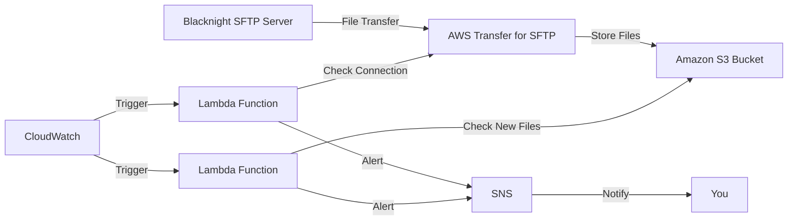

AWS Transfer for SFTP is a fully managed service that enables the transfer of files directly into and out of Amazon S3
using the Secure File Transfer Protocol (SFTP). Here's a breakdown of its key features and functions:

1. Managed SFTP Server:
    - It provides a fully managed SFTP server, eliminating the need to run your own SFTP server on EC2 instances or
      on-premises.

2. S3 Integration:
    - It allows you to transfer files directly into and out of Amazon S3 buckets using SFTP.
    - Files transferred via SFTP appear as objects in your S3 buckets.

3. Security:
    - Supports secure transfer of files over SFTP, which encrypts both commands and data in transit.
    - Integrates with AWS Identity and Access Management (IAM) for authentication and access control.

4. Custom Domain:
    - You can use your own custom domain for your SFTP server endpoints.

5. Multiple Authentication Methods:
    - Supports various authentication methods including SSH keys and passwords.

6. Scalability:
    - Automatically scales to meet your transfer demands without requiring you to provision capacity.

7. Logging and Monitoring:
    - Integrates with CloudWatch for logging and monitoring of file transfer activities.

In the context of your Blacknight SFTP server monitoring:

1. Connection to Blacknight:
    - AWS Transfer for SFTP would be configured to connect to the Blacknight SFTP server.
    - It acts as an intermediary, allowing you to access the Blacknight server through AWS's managed infrastructure.

2. File Storage:
    - Files from the Blacknight server would be transferred into an S3 bucket through AWS Transfer.

3. Monitoring:
    - Your Lambda functions would interact with AWS Transfer to check the connection status.
    - They would also check the S3 bucket for new file arrivals.

4. Security:
    - AWS Transfer ensures that all file transfers are done securely over SFTP.

5. Scalability:
    - As your file transfer needs grow, AWS Transfer can handle increased load without you needing to manage the
      underlying infrastructure.

By using AWS Transfer for SFTP, you're essentially outsourcing the management of the SFTP server to AWS, which can
provide better reliability, security, and scalability compared to running your own SFTP server. It also integrates
seamlessly with other AWS services like S3, Lambda, and CloudWatch, which makes it easier to build comprehensive
solutions like the monitoring system we've discussed.

Would you like more information on how to set up AWS Transfer for SFTP or how to integrate it with the other components
of your monitoring solution?