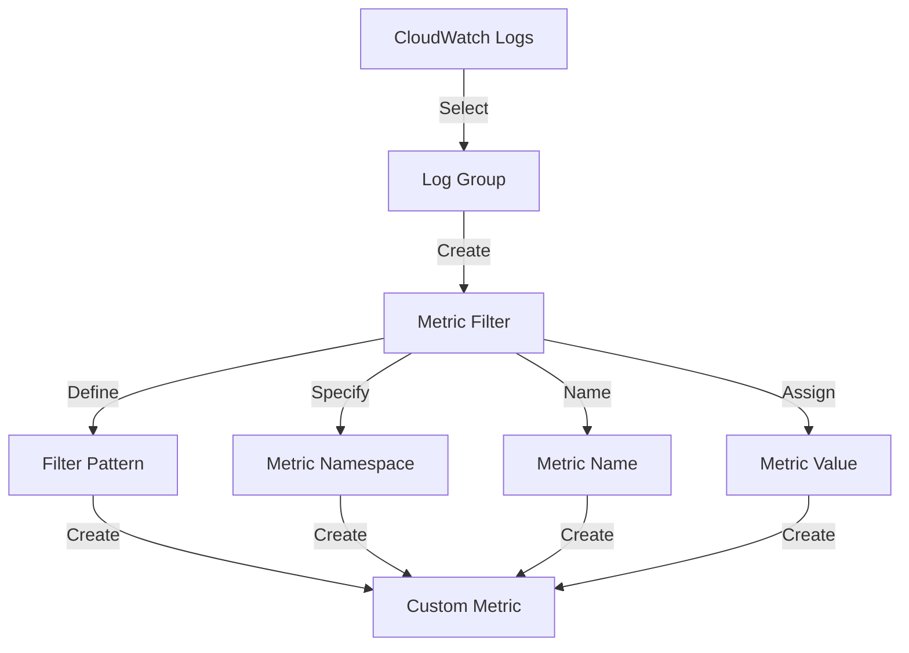

I apologize for not being clear earlier. You're right, creating custom metrics is an important process that deserves a more detailed explanation. Let's break it down step-by-step with a focus on creating custom metrics from Lambda logs using CloudWatch Metric Filters.

Here's a more detailed process:

1. Lambda Function Logging:
   First, ensure your Lambda function is logging the data you want to track. For our example:

```python
import logging

logger = logging.getLogger()
logger.setLevel(logging.INFO)

def lambda_handler(event, context):
    # SFTP connection check
    sftp_success = check_sftp_connection()
    if sftp_success:
        logger.info("SFTP_CONNECTION_SUCCESS")
    else:
        logger.error("SFTP_CONNECTION_FAILURE")
  
    # S3 file count check
    file_count = count_s3_files()
    logger.info(f"S3_FILE_COUNT:{file_count}")

    return {
        'statusCode': 200,
        'body': 'Checks completed'
    }

```

2. Creating CloudWatch Metric Filters:
   After your Lambda function has run a few times and generated logs, you can create metric filters:

a. Go to the AWS Management Console and navigate to CloudWatch.
b. In the left navigation pane, under Logs, click on "Log groups".
c. Find and click on the log group for your Lambda function (usually `/aws/lambda/YourFunctionName`).
d. Click on the "Metric filters" tab, then click "Create metric filter".

Let's create two metric filters:

For SFTP Connection:

- Filter pattern: `SFTP_CONNECTION_SUCCESS`
- Filter name: `SFTPConnectionSuccess`
- Metric namespace: `CustomMetrics`
- Metric name: `SFTPConnectionSuccess`
- Metric value: `1`



For S3 File Count:

- Filter pattern: `S3_FILE_COUNT:`
- Filter name: `S3FileCount`
- Metric namespace: `CustomMetrics`
- Metric name: `S3FileCount`
- Metric value: `$2` (This extracts the number after the colon)

3. Viewing and Using Custom Metrics:
   Once you've created these metric filters, CloudWatch will start generating metrics based on your Lambda function's logs.

To view these metrics:
a. In CloudWatch, go to "Metrics" in the left navigation pane.
b. Find and click on your custom namespace (in this case, "CustomMetrics").
c. You should see your custom metrics listed.

4. Creating CloudWatch Alarms from Custom Metrics:
   Now that you have custom metrics, you can create alarms based on them.

```bash
aws cloudwatch put-metric-alarm \
    --alarm-name "LowSFTPConnectionSuccess" \
    --alarm-description "Alarm when SFTP connection fails" \
    --metric-name "SFTPConnectionSuccess" \
    --namespace "CustomMetrics" \
    --statistic Sum \
    --period 300 \
    --threshold 0 \
    --comparison-operator LessThanOrEqualToThreshold \
    --evaluation-periods 1 \
    --alarm-actions arn:aws:sns:region:account-id:YourSNSTopic

```

This alarm will trigger if the sum of successful SFTP connections is 0 over a 5-minute period.

5. Best Practices for Custom Metrics:

- Use consistent naming conventions for your metrics.
- Group related metrics under the same namespace.
- Be mindful of costs – creating too many custom metrics can increase your CloudWatch costs.
- Regularly review and clean up unused metrics and alarms.

By following these steps, you create a pipeline from your Lambda function's logs to custom CloudWatch metrics, which you can then use for monitoring and alerting. This approach gives you fine-grained control over what you monitor and how you respond to different conditions in your application.

Is there any specific part of this process you'd like me to elaborate on further?
