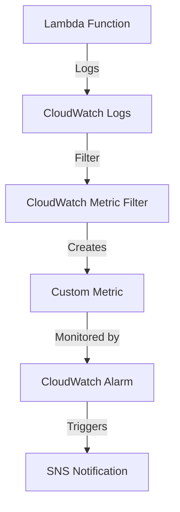

Certainly! I'll explain how Lambda can be used to monitor an SFTP connection and S3 file count, and how this integrates
with CloudWatch Logs, Metrics, and Alarms. I'll provide a simple example to illustrate this process.

Let's consider a scenario where we want to:

1. Check the connection to an SFTP server every 5 minutes
2. Count the number of files in an S3 bucket daily
3. Log these results
4. Create alarms based on these checks

Here's how we can set this up:

1. Lambda Function:

```python
import boto3
import paramiko
import logging

logger = logging.getLogger()
logger.setLevel(logging.INFO)


def lambda_handler(event, context):
    # SFTP connection check
    try:
        sftp = paramiko.SSHClient()
        sftp.set_missing_host_key_policy(paramiko.AutoAddPolicy())
        sftp.connect('sftp.example.com', username='user', password='password')
        logger.info("SFTP connection successful")
        sftp.close()
    except Exception as e:
        logger.error(f"SFTP connection failed: {str(e)}")

    # S3 file count check
    s3 = boto3.client('s3')
    bucket_name = 'your-bucket-name'
    try:
        response = s3.list_objects_v2(Bucket=bucket_name)
        file_count = len(response.get('Contents', []))
        logger.info(f"S3 file count: {file_count}")
    except Exception as e:
        logger.error(f"S3 file count check failed: {str(e)}")

    return {
        'sftp_connection': 'success' if 'SFTP connection successful' in logger.info.output else 'failure',
        's3_file_count': file_count if 'file_count' in locals() else -1
    }

```

This Lambda function does two things:

- Attempts to connect to an SFTP server
- Counts the number of files in an S3 bucket

It logs the results of both operations.

2. CloudWatch Logs:
   The Lambda function automatically logs to CloudWatch Logs. You can find these logs in the CloudWatch console under
   the log group `/aws/lambda/YourFunctionName`.
3. CloudWatch Metrics:
   We can create custom metrics based on our Lambda function's output. Here's how:



To create a custom metric:

1. Go to CloudWatch Logs in the AWS Console
2. Select the log group for your Lambda function
3. Create a metric filter:

   - For SFTP connection: Filter pattern `"SFTP connection successful"`
   - For S3 file count: Filter pattern `"S3 file count: *"`
4. CloudWatch Alarms:
   Now we can create alarms based on these metrics:

```bash
# Alarm for SFTP connection failure
# This alarm will trigger if the sum of successful SFTP connections is 0 over a 5-minute period.
aws cloudwatch put-metric-alarm \
    --alarm-name "SFTPConnectionFailure" \
    --alarm-description "Alarm when SFTP connection fails" \
    --metric-name "SFTPConnectionSuccess" \
    --namespace "CustomMetrics" \
    --statistic Sum \
    --period 300 \
    --threshold 0 \
    --comparison-operator LessThanThreshold \
    --evaluation-periods 1 \
    --alarm-actions arn:aws:sns:region:account-id:YourSNSTopic

# Alarm for low S3 file count

aws cloudwatch put-metric-alarm \
    --alarm-name "LowS3FileCount" \
    --alarm-description "Alarm when S3 file count is low" \
    --metric-name "S3FileCount" \
    --namespace "CustomMetrics" \
    --statistic Average \
    --period 86400 \
    --threshold 10 \
    --comparison-operator LessThanThreshold \
    --evaluation-periods 1 \
    --alarm-actions arn:aws:sns:region:account-id:YourSNSTopic

```

These alarms will:

- Trigger if the SFTP connection fails (i.e., the "SFTPConnectionSuccess" metric is 0 in a 5-minute period)
- Trigger if the average S3 file count is less than 10 in a 24-hour period

When these alarms trigger, they will send a notification to the specified SNS topic.

In summary:

1. The Lambda function performs checks and logs results
2. CloudWatch Logs collects these logs
3. Metric Filters extract relevant data from logs
4. Custom Metrics are created based on these filters
5. CloudWatch Alarms monitor these metrics and trigger when thresholds are breached

This setup provides a comprehensive monitoring solution for your SFTP connection and S3 file count, with automated
alerts for any issues.
