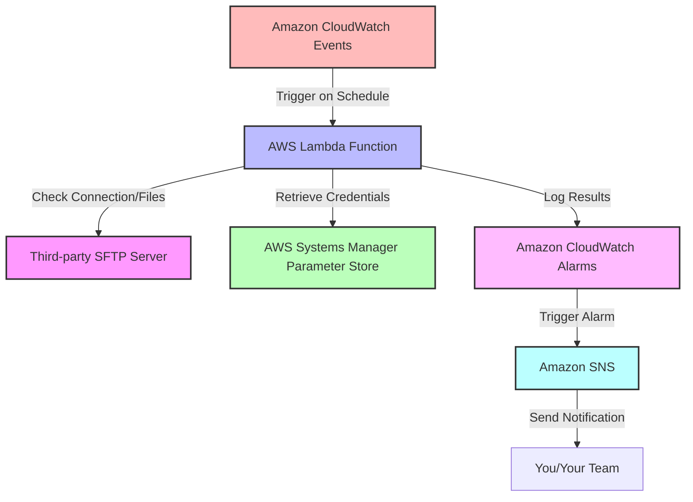

Certainly! I'll explain how to set up monitoring for a third-party SFTP server using AWS Lambda, Amazon CloudWatch, and
AWS Systems Manager Parameter Store, and then provide a flow diagram to illustrate the process.

Here's how you can implement this solution:

1. AWS Systems Manager Parameter Store:
    - Store SFTP server credentials securely (hostname, username, password/key).

2. AWS Lambda:
    - Create a Lambda function to check the SFTP server connection and look for new files.
    - The function will retrieve credentials from Parameter Store.

3. Amazon CloudWatch:
    - Set up CloudWatch Events to trigger the Lambda function on a schedule.
    - Use CloudWatch Alarms to alert on function failures or specific conditions.

4. Amazon SNS (Simple Notification Service):
    - Set up to send notifications when alarms are triggered.

Now, let's create a flow diagram to visualize this setup:

Here's a detailed explanation of the flow:

1. CloudWatch Events triggers the Lambda function on a scheduled basis (e.g., every 5 minutes).

2. The Lambda function retrieves the SFTP server credentials from Systems Manager Parameter Store.

3. Using these credentials, the Lambda function attempts to connect to the third-party SFTP server and perform checks (
   e.g., connection status, presence of new files).

4. The Lambda function logs its results to CloudWatch Logs.

5. CloudWatch Alarms monitor these logs for specific conditions (e.g., connection failures, no new files for X hours).

6. If an alarm condition is met, it triggers an SNS topic.

7. SNS sends a notification to you or your team via email, SMS, or other configured endpoints.

To implement this solution:

1. In Systems Manager Parameter Store:
    - Create secure string parameters for SFTP hostname, username, and password/key.

2. Create a Lambda function:
    - Use a language with SFTP library support (e.g., Python with paramiko).
    - Retrieve SFTP credentials from Parameter Store.
    - Implement SFTP connection and file checking logic.
    - Log results and any errors.

3. Set up CloudWatch:
    - Create a CloudWatch Events rule to trigger the Lambda function on schedule.
    - Set up CloudWatch Alarms to monitor Lambda function outputs.

4. Configure SNS:
    - Create an SNS topic and subscribe relevant endpoints (email, SMS, etc.).

5. Set up IAM roles:
    - Ensure the Lambda function has permissions to access Parameter Store, CloudWatch, and SNS.

This setup provides a serverless, scalable solution for monitoring third-party SFTP servers. It's cost-effective as you
only pay for Lambda executions and CloudWatch usage, and it's easily adaptable to monitor multiple SFTP servers by
adjusting the Lambda function and Parameter Store entries.

Would you like me to provide a sample Lambda function code or elaborate on any specific part of this setup?