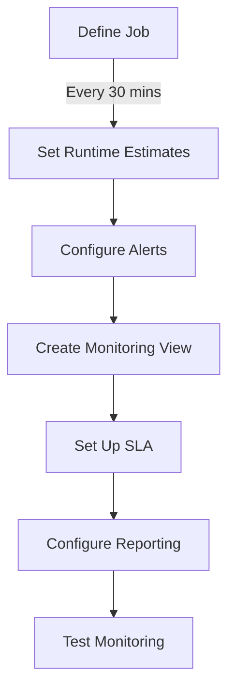

Certainly! To add monitoring to a Control-M job that runs every 30 minutes, you can use several built-in features of Control-M. Here's a step-by-step guide on how to set up monitoring for this specific job:

1. Job Definition Monitoring:

First, ensure your job is properly defined in Control-M:

- Open Control-M/Enterprise Manager
- Locate your job in the job definition area
- Verify that the scheduling is set to run every 30 minutes

2. Set Up Basic Monitoring:




Now, let's go through each step in detail:

3. Set Runtime Estimates:
   - In the job definition, set an estimated runtime for the job
   - This helps Control-M identify if the job is running longer than expected

4. Configure Alerts:
   - In the job definition, go to the "Alerts" tab
   - Set up alerts for various conditions:
     - Job failure
     - Job exceeds estimated runtime
     - Job starts late
     - Job doesn't start
   - Define the alert method (e.g., email, SMS, SNMP trap)

5. Create a Monitoring View:
   - In Control-M/Monitoring, create a new view specifically for this job
   - Include columns for job status, start time, end time, and duration
   - Set up filters to show only this specific job

6. Set Up Service Level Agreement (SLA):
   - In the job definition, go to the "SLA Management" tab
   - Define an SLA for the job (e.g., must complete within 25 minutes of starting)
   - Set up alerts for SLA violations

7. Configure Reporting:
   - Use Control-M/Reporting or Control-M/Analytics
   - Set up a report to show the job's run history, including start times, end times, and status
   - Schedule this report to be generated daily or weekly

8. Implement Proactive Monitoring:
   - Use Control-M's predictive analytics to forecast potential issues with the job
   - Set up alerts if the job is predicted to miss its next scheduled run

9. Use Control-M/Self Service:
   - If relevant, set up a Self Service view for business users to monitor this job

10. Mobile Monitoring:
    - Configure Control-M/Web to allow mobile access to the job's status

11. Test Your Monitoring Setup:
    - Run the job manually and verify that all monitoring components work as expected
    - Simulate failure scenarios to ensure alerts are triggered properly

Here's a sample alert configuration you might use:


```pseudo
JOB_NAME: "30_Minute_Job"
SCHEDULE: "Every 30 minutes"

ALERTS:
  - ON_FAILURE:
      NOTIFICATION: Email
      RECIPIENTS: [operator@company.com, manager@company.com]
      MESSAGE: "30_Minute_Job has failed. Please investigate immediately."

  - ON_LATE_START:
      CONDITION: "5 minutes after scheduled start time"
      NOTIFICATION: SMS
      RECIPIENTS: [+1234567890]
      MESSAGE: "30_Minute_Job start is delayed by more than 5 minutes."

  - ON_LONG_RUN:
      CONDITION: "Job runs for more than 20 minutes"
      NOTIFICATION: Email
      RECIPIENTS: [operator@company.com]
      MESSAGE: "30_Minute_Job is running longer than expected. Please check for issues."

  - ON_SLA_BREACH:
      CONDITION: "Job not completed 25 minutes after scheduled start time"
      NOTIFICATION: Email, SMS
      RECIPIENTS: [operator@company.com, +1234567890]
      MESSAGE: "SLA breach for 30_Minute_Job. Immediate attention required."

```

This configuration sets up various alerts for different scenarios that might occur with your 30-minute job.

Remember, the exact steps and options might vary slightly depending on your specific version of Control-M. Always refer to your Control-M documentation or consult with your Control-M administrator for version-specific guidance.

By implementing these monitoring measures, you'll have comprehensive visibility into the performance and status of your 30-minute job, allowing for quick responses to any issues that may arise.

Would you like me to elaborate on any specific part of this monitoring setup?