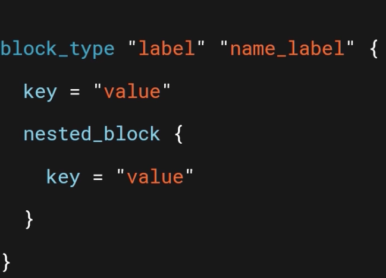

# Terraform

Terraform Object Types
----------------------
1. Providers - in our case AWS, could be Azure or GCP
2. Resources - ec2 instances, database etc
3. Data sources - are based are on provider - could be a list of AZ’s in a region, AMI’s that can be used, etc

Terraform Block syntax
 - JSON like syntax with provision to add comments, where label name is prvoder specific and name_lable is the alias.


Build/Deploy Steps
--------------------
terraform init —> pulls provider plugin If need be, get state info
terraform plan —> plan to update the target
terraform apply —> resources created and state data updated
terraform destroy —>  destroy target env

Useful Links
--------------
- https://registry.terraform.io/providers/hashicorp/aws/latest/docs
- https://github.com/ned1313/Getting-Started-Terraform
